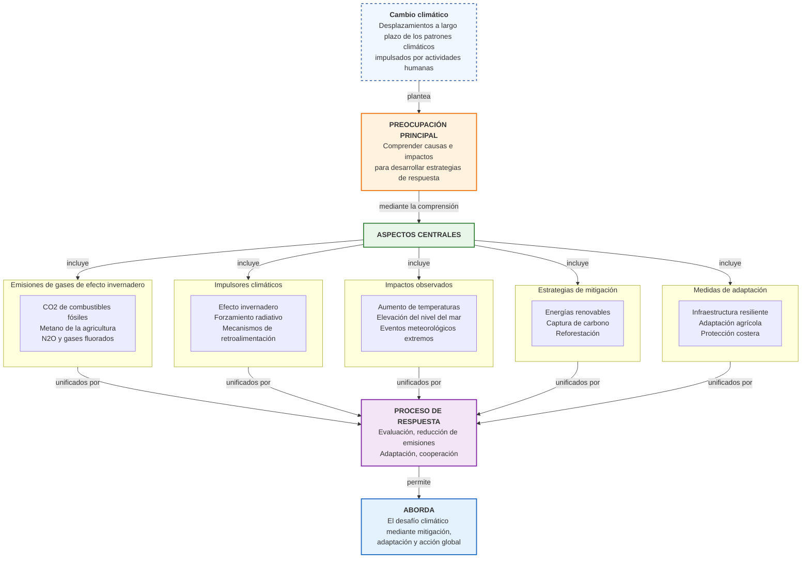

```mermaid
flowchart TD
    A[<b>Cambio climático</b><br>Desplazamientos a largo plazo de los patrones climáticos<br>impulsados por actividades humanas]:::title
    B[<b>PREOCUPACIÓN PRINCIPAL</b><br>Comprender causas e impactos<br>para desarrollar estrategias de respuesta]:::concern
    C[<b>ASPECTOS CENTRALES</b>]:::aspects
    
    subgraph D[Emisiones de gases de efecto invernadero]
        D1[CO2 de combustibles fósiles<br>Metano de la agricultura<br>N2O y gases fluorados]
    end
    
    subgraph E[Impulsores climáticos]
        E1[Efecto invernadero<br>Forzamiento radiativo<br>Mecanismos de retroalimentación]
    end
    
    subgraph F[Impactos observados]
        F1[Aumento de temperaturas<br>Elevación del nivel del mar<br>Eventos meteorológicos extremos]
    end
    
    subgraph G[Estrategias de mitigación]
        G1[Energías renovables<br>Captura de carbono<br>Reforestación]
    end
    
    subgraph H[Medidas de adaptación]
        H1[Infraestructura resiliente<br>Adaptación agrícola<br>Protección costera]
    end
    
    I[<b>PROCESO DE RESPUESTA</b><br>Evaluación, reducción de emisiones<br>Adaptación, cooperación]:::process
    
    J[<b>ABORDA</b><br>El desafío climático mediante mitigación,<br>adaptación y acción global]:::outcome
    
    A -->|plantea| B
    B -->|mediante la comprensión| C
    C -->|incluye| D
    C -->|incluye| E
    C -->|incluye| F
    C -->|incluye| G
    C -->|incluye| H
    D & E & F & G & H -->|unificados por| I
    I -->|permite| J
    
    classDef title fill:#f0f7ff,stroke:#4a6fa5,stroke-width:2px,color:#333,stroke-dasharray: 5 5
    classDef concern fill:#fff3e0,stroke:#ef6c00,stroke-width:2px,color:#333
    classDef aspects fill:#e8f5e9,stroke:#2e7d32,stroke-width:2px,color:#333
    classDef process fill:#f3e5f5,stroke:#7b1fa2,stroke-width:2px,color:#333
    classDef outcome fill:#e3f2fd,stroke:#1565c0,stroke-width:2px,color:#333
```
