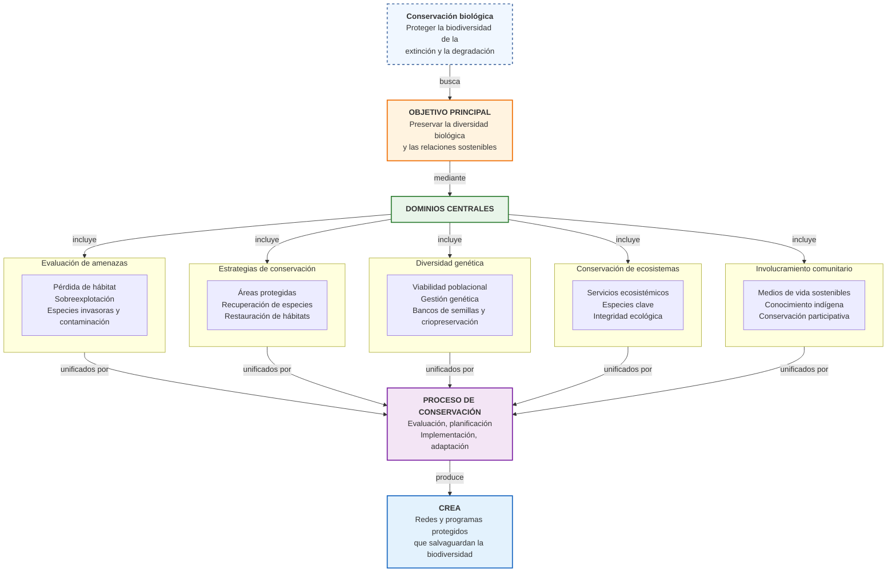

```mermaid
flowchart TD
    A[<b>Conservación biológica</b><br>Proteger la biodiversidad de la<br>extinción y la degradación]:::title
    B[<b>OBJETIVO PRINCIPAL</b><br>Preservar la diversidad biológica<br>y las relaciones sostenibles]:::objective
    C[<b>DOMINIOS CENTRALES</b>]:::domains
    
    subgraph D[Evaluación de amenazas]
        D1[Pérdida de hábitat<br>Sobreexplotación<br>Especies invasoras y contaminación]
    end
    
    subgraph E[Estrategias de conservación]
        E1[Áreas protegidas<br>Recuperación de especies<br>Restauración de hábitats]
    end
    
    subgraph F[Diversidad genética]
        F1[Viabilidad poblacional<br>Gestión genética<br>Bancos de semillas y criopreservación]
    end
    
    subgraph G[Conservación de ecosistemas]
        G1[Servicios ecosistémicos<br>Especies clave<br>Integridad ecológica]
    end
    
    subgraph H[Involucramiento comunitario]
        H1[Medios de vida sostenibles<br>Conocimiento indígena<br>Conservación participativa]
    end
    
    I[<b>PROCESO DE CONSERVACIÓN</b><br>Evaluación, planificación<br>Implementación, adaptación]:::process
    
    J[<b>CREA</b><br>Redes y programas protegidos<br>que salvaguardan la biodiversidad]:::outcome
    
    A -->|busca| B
    B -->|mediante| C
    C -->|incluye| D
    C -->|incluye| E
    C -->|incluye| F
    C -->|incluye| G
    C -->|incluye| H
    D & E & F & G & H -->|unificados por| I
    I -->|produce| J
    
    classDef title fill:#f0f7ff,stroke:#4a6fa5,stroke-width:2px,color:#333,stroke-dasharray: 5 5
    classDef objective fill:#fff3e0,stroke:#ef6c00,stroke-width:2px,color:#333
    classDef domains fill:#e8f5e9,stroke:#2e7d32,stroke-width:2px,color:#333
    classDef process fill:#f3e5f5,stroke:#7b1fa2,stroke-width:2px,color:#333
    classDef outcome fill:#e3f2fd,stroke:#1565c0,stroke-width:2px,color:#333
```
