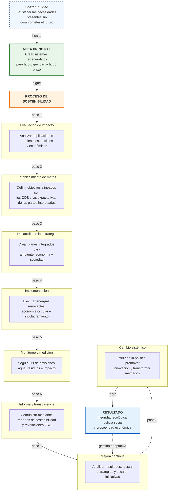

```mermaid
flowchart TD
    A[<b>Sostenibilidad</b><br>Satisfacer las necesidades presentes sin<br>comprometer el futuro]:::title
    B[<b>META PRINCIPAL</b><br>Crear sistemas regenerativos<br>para la prosperidad a largo plazo]:::goal
    C[<b>PROCESO DE SOSTENIBILIDAD</b>]:::process
    
    subgraph D[Evaluación de impacto]
        D1[Analizar implicaciones ambientales, sociales<br>y económicas]
    end
    
    subgraph E[Establecimiento de metas]
        E1[Definir objetivos alineados con<br>los ODS y las expectativas de las partes interesadas]
    end
    
    subgraph F[Desarrollo de la estrategia]
        F1[Crear planes integrados para<br>ambiente, economía y sociedad]
    end
    
    subgraph G[Implementación]
        G1[Ejecutar energías renovables,<br>economía circular e involucramiento]
    end
    
    subgraph H[Monitoreo y medición]
        H1[Seguir KPI de emisiones,<br>agua, residuos e impacto]
    end
    
    subgraph I[Informe y transparencia]
        I1[Comunicar mediante reportes de sostenibilidad<br>y revelaciones ASG]
    end
    
    subgraph J[Mejora continua]
        J1[Analizar resultados, ajustar<br>estrategias y escalar iniciativas]
    end
    
    subgraph K[Cambio sistémico]
        K1[Influir en la política, promover<br>innovación y transformar mercados]
    end
    
    L[<b>RESULTADO</b><br>Integridad ecológica, justicia social<br>y prosperidad económica]:::outcome
    
    A -->|busca| B
    B -->|sigue| C
    C -->|paso 1| D
    D -->|paso 2| E
    E -->|paso 3| F
    F -->|paso 4| G
    G -->|paso 5| H
    H -->|paso 6| I
    I -->|paso 7| J
    J -->|paso 8| K
    K -->|logra| L
    L -.->|gestión adaptativa| J
    
    classDef title fill:#f0f7ff,stroke:#4a6fa5,stroke-width:2px,color:#333,stroke-dasharray:5 5
    classDef goal fill:#e8f5e9,stroke:#2e7d32,stroke-width:2px,color:#333
    classDef process fill:#fff3e0,stroke:#ef6c00,stroke-width:2px,color:#333
    classDef outcome fill:#e3f2fd,stroke:#1565c0,stroke-width:2px,color:#333
```
