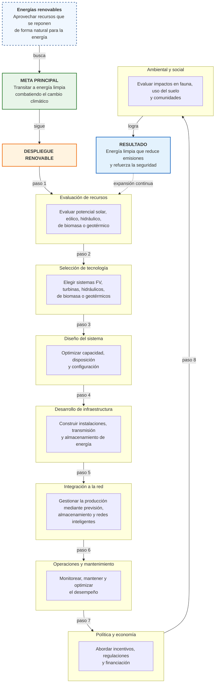

```mermaid
flowchart TD
    A[<b>Energías renovables</b><br>Aprovechar recursos que se reponen<br>de forma natural para la energía]:::title
    B[<b>META PRINCIPAL</b><br>Transitar a energía limpia<br>combatiendo el cambio climático]:::goal
    C[<b>DESPLIEGUE RENOVABLE</b>]:::process
    
    subgraph D[Evaluación de recursos]
        D1[Evaluar potencial solar, eólico, hidráulico,<br>de biomasa o geotérmico]
    end
    
    subgraph E[Selección de tecnología]
        E1[Elegir sistemas FV, turbinas, hidráulicos,<br>de biomasa o geotérmicos]
    end
    
    subgraph F[Diseño del sistema]
        F1[Optimizar capacidad, disposición<br>y configuración]
    end
    
    subgraph G[Desarrollo de infraestructura]
        G1[Construir instalaciones, transmisión<br>y almacenamiento de energía]
    end
    
    subgraph H[Integración a la red]
        H1[Gestionar la producción mediante previsión,<br>almacenamiento y redes inteligentes]
    end
    
    subgraph I[Operaciones y mantenimiento]
        I1[Monitorear, mantener y optimizar<br>el desempeño]
    end
    
    subgraph J[Política y economía]
        J1[Abordar incentivos, regulaciones<br>y financiación]
    end
    
    subgraph K[Ambiental y social]
        K1[Evaluar impactos en fauna, uso del suelo<br>y comunidades]
    end
    
    L[<b>RESULTADO</b><br>Energía limpia que reduce emisiones<br>y refuerza la seguridad]:::outcome
    
    A -->|busca| B
    B -->|sigue| C
    C -->|paso 1| D
    D -->|paso 2| E
    E -->|paso 3| F
    F -->|paso 4| G
    G -->|paso 5| H
    H -->|paso 6| I
    I -->|paso 7| J
    J -->|paso 8| K
    K -->|logra| L
    L -.->|expansión continua| D
    
    classDef title fill:#f0f7ff,stroke:#4a6fa5,stroke-width:2px,color:#333,stroke-dasharray:5 5
    classDef goal fill:#e8f5e9,stroke:#2e7d32,stroke-width:2px,color:#333
    classDef process fill:#fff3e0,stroke:#ef6c00,stroke-width:2px,color:#333
    classDef outcome fill:#e3f2fd,stroke:#1565c0,stroke-width:2px,color:#333
```
