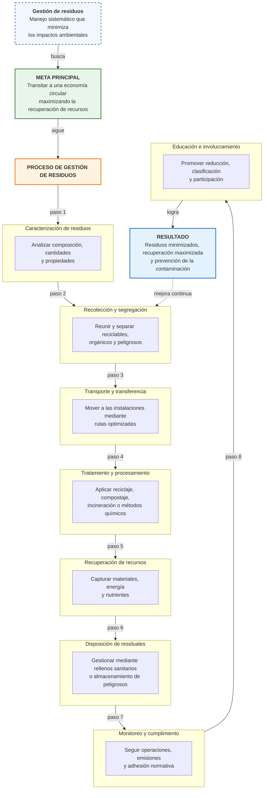

```mermaid
flowchart TD
    A[<b>Gestión de residuos</b><br>Manejo sistemático que minimiza<br>los impactos ambientales]:::title
    B[<b>META PRINCIPAL</b><br>Transitar a una economía circular<br>maximizando la recuperación de recursos]:::goal
    C[<b>PROCESO DE GESTIÓN DE RESIDUOS</b>]:::process
    
    subgraph D[Caracterización de residuos]
        D1[Analizar composición, cantidades<br>y propiedades]
    end
    
    subgraph E[Recolección y segregación]
        E1[Reunir y separar reciclables,<br>orgánicos y peligrosos]
    end
    
    subgraph F[Transporte y transferencia]
        F1[Mover a las instalaciones mediante<br>rutas optimizadas]
    end
    
    subgraph G[Tratamiento y procesamiento]
        G1[Aplicar reciclaje, compostaje,<br>incineración o métodos químicos]
    end
    
    subgraph H[Recuperación de recursos]
        H1[Capturar materiales, energía<br>y nutrientes]
    end
    
    subgraph I[Disposición de residuales]
        I1[Gestionar mediante rellenos sanitarios<br>o almacenamiento de peligrosos]
    end
    
    subgraph J[Monitoreo y cumplimiento]
        J1[Seguir operaciones, emisiones<br>y adhesión normativa]
    end
    
    subgraph K[Educación e involucramiento]
        K1[Promover reducción, clasificación<br>y participación]
    end
    
    L[<b>RESULTADO</b><br>Residuos minimizados, recuperación maximizada<br>y prevención de la contaminación]:::outcome
    
    A -->|busca| B
    B -->|sigue| C
    C -->|paso 1| D
    D -->|paso 2| E
    E -->|paso 3| F
    F -->|paso 4| G
    G -->|paso 5| H
    H -->|paso 6| I
    I -->|paso 7| J
    J -->|paso 8| K
    K -->|logra| L
    L -.->|mejora continua| E
    
    classDef title fill:#f0f7ff,stroke:#4a6fa5,stroke-width:2px,color:#333,stroke-dasharray:5 5
    classDef goal fill:#e8f5e9,stroke:#2e7d32,stroke-width:2px,color:#333
    classDef process fill:#fff3e0,stroke:#ef6c00,stroke-width:2px,color:#333
    classDef outcome fill:#e3f2fd,stroke:#1565c0,stroke-width:2px,color:#333
```
