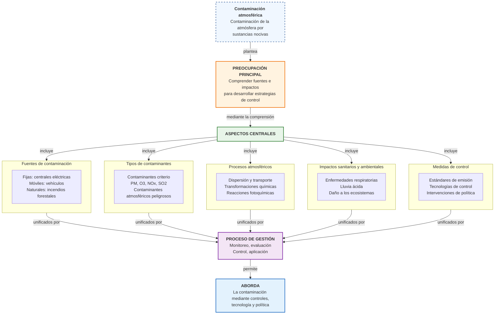

```mermaid
flowchart TD
    A[<b>Contaminación atmosférica</b><br>Contaminación de la atmósfera por<br>sustancias nocivas]:::title
    B[<b>PREOCUPACIÓN PRINCIPAL</b><br>Comprender fuentes e impactos<br>para desarrollar estrategias de control]:::concern
    C[<b>ASPECTOS CENTRALES</b>]:::aspects
    
    subgraph D[Fuentes de contaminación]
        D1[Fijas: centrales eléctricas<br>Móviles: vehículos<br>Naturales: incendios forestales]
    end
    
    subgraph E[Tipos de contaminantes]
        E1[Contaminantes criterio<br>PM, O3, NOx, SO2<br>Contaminantes atmosféricos peligrosos]
    end
    
    subgraph F[Procesos atmosféricos]
        F1[Dispersión y transporte<br>Transformaciones químicas<br>Reacciones fotoquímicas]
    end
    
    subgraph G[Impactos sanitarios y ambientales]
        G1[Enfermedades respiratorias<br>Lluvia ácida<br>Daño a los ecosistemas]
    end
    
    subgraph H[Medidas de control]
        H1[Estándares de emisión<br>Tecnologías de control<br>Intervenciones de política]
    end
    
    I[<b>PROCESO DE GESTIÓN</b><br>Monitoreo, evaluación<br>Control, aplicación]:::process
    
    J[<b>ABORDA</b><br>La contaminación mediante controles,<br>tecnología y política]:::outcome
    
    A -->|plantea| B
    B -->|mediante la comprensión| C
    C -->|incluye| D
    C -->|incluye| E
    C -->|incluye| F
    C -->|incluye| G
    C -->|incluye| H
    D & E & F & G & H -->|unificados por| I
    I -->|permite| J
    
    classDef title fill:#f0f7ff,stroke:#4a6fa5,stroke-width:2px,color:#333,stroke-dasharray: 5 5
    classDef concern fill:#fff3e0,stroke:#ef6c00,stroke-width:2px,color:#333
    classDef aspects fill:#e8f5e9,stroke:#2e7d32,stroke-width:2px,color:#333
    classDef process fill:#f3e5f5,stroke:#7b1fa2,stroke-width:2px,color:#333
    classDef outcome fill:#e3f2fd,stroke:#1565c0,stroke-width:2px,color:#333
```
