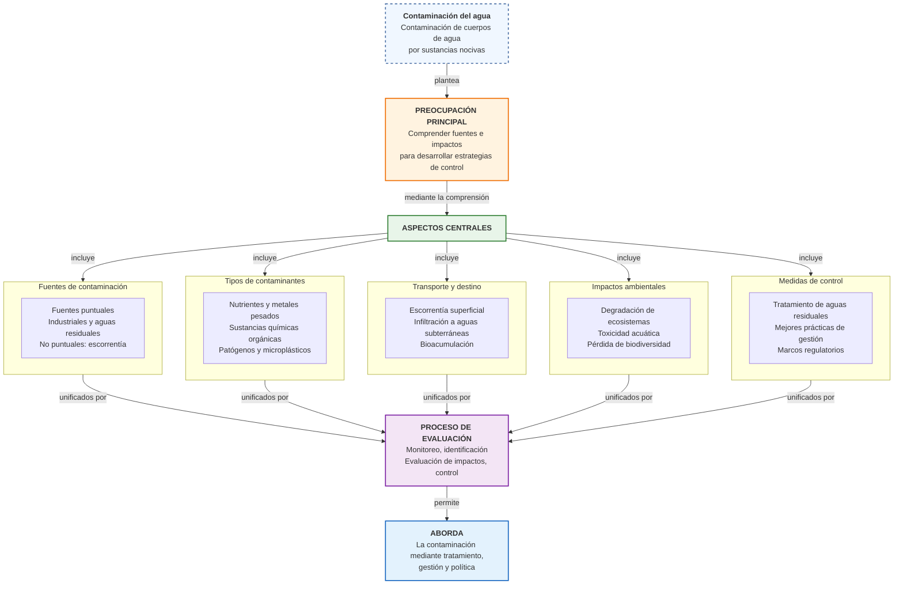

```mermaid
flowchart TD
    A[<b>Contaminación del agua</b><br>Contaminación de cuerpos de agua<br>por sustancias nocivas]:::title
    B[<b>PREOCUPACIÓN PRINCIPAL</b><br>Comprender fuentes e impactos<br>para desarrollar estrategias de control]:::concern
    C[<b>ASPECTOS CENTRALES</b>]:::aspects
    
    subgraph D[Fuentes de contaminación]
        D1[Fuentes puntuales<br>Industriales y aguas residuales<br>No puntuales: escorrentía]
    end
    
    subgraph E[Tipos de contaminantes]
        E1[Nutrientes y metales pesados<br>Sustancias químicas orgánicas<br>Patógenos y microplásticos]
    end
    
    subgraph F[Transporte y destino]
        F1[Escorrentía superficial<br>Infiltración a aguas subterráneas<br>Bioacumulación]
    end
    
    subgraph G[Impactos ambientales]
        G1[Degradación de ecosistemas<br>Toxicidad acuática<br>Pérdida de biodiversidad]
    end
    
    subgraph H[Medidas de control]
        H1[Tratamiento de aguas residuales<br>Mejores prácticas de gestión<br>Marcos regulatorios]
    end
    
    I[<b>PROCESO DE EVALUACIÓN</b><br>Monitoreo, identificación<br>Evaluación de impactos, control]:::process
    
    J[<b>ABORDA</b><br>La contaminación mediante tratamiento,<br>gestión y política]:::outcome
    
    A -->|plantea| B
    B -->|mediante la comprensión| C
    C -->|incluye| D
    C -->|incluye| E
    C -->|incluye| F
    C -->|incluye| G
    C -->|incluye| H
    D & E & F & G & H -->|unificados por| I
    I -->|permite| J
    
    classDef title fill:#f0f7ff,stroke:#4a6fa5,stroke-width:2px,color:#333,stroke-dasharray: 5 5
    classDef concern fill:#fff3e0,stroke:#ef6c00,stroke-width:2px,color:#333
    classDef aspects fill:#e8f5e9,stroke:#2e7d32,stroke-width:2px,color:#333
    classDef process fill:#f3e5f5,stroke:#7b1fa2,stroke-width:2px,color:#333
    classDef outcome fill:#e3f2fd,stroke:#1565c0,stroke-width:2px,color:#333
```
