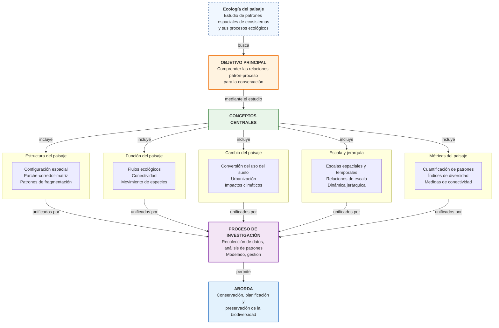

```mermaid
flowchart TD
    A[<b>Ecología del paisaje</b><br>Estudio de patrones espaciales de ecosistemas<br>y sus procesos ecológicos]:::title
    B[<b>OBJETIVO PRINCIPAL</b><br>Comprender las relaciones patrón-proceso<br>para la conservación]:::objective
    C[<b>CONCEPTOS CENTRALES</b>]:::concepts
    
    subgraph D[Estructura del paisaje]
        D1[Configuración espacial<br>Parche-corredor-matriz<br>Patrones de fragmentación]
    end
    
    subgraph E[Función del paisaje]
        E1[Flujos ecológicos<br>Conectividad<br>Movimiento de especies]
    end
    
    subgraph F[Cambio del paisaje]
        F1[Conversión del uso del suelo<br>Urbanización<br>Impactos climáticos]
    end
    
    subgraph G[Escala y jerarquía]
        G1[Escalas espaciales y temporales<br>Relaciones de escala<br>Dinámica jerárquica]
    end
    
    subgraph H[Métricas del paisaje]
        H1[Cuantificación de patrones<br>Índices de diversidad<br>Medidas de conectividad]
    end
    
    I[<b>PROCESO DE INVESTIGACIÓN</b><br>Recolección de datos, análisis de patrones<br>Modelado, gestión]:::process
    
    J[<b>ABORDA</b><br>Conservación, planificación y<br>preservación de la biodiversidad]:::outcome
    
    A -->|busca| B
    B -->|mediante el estudio| C
    C -->|incluye| D
    C -->|incluye| E
    C -->|incluye| F
    C -->|incluye| G
    C -->|incluye| H
    D & E & F & G & H -->|unificados por| I
    I -->|permite| J
    
    classDef title fill:#f0f7ff,stroke:#4a6fa5,stroke-width:2px,color:#333,stroke-dasharray: 5 5
    classDef objective fill:#fff3e0,stroke:#ef6c00,stroke-width:2px,color:#333
    classDef concepts fill:#e8f5e9,stroke:#2e7d32,stroke-width:2px,color:#333
    classDef process fill:#f3e5f5,stroke:#7b1fa2,stroke-width:2px,color:#333
    classDef outcome fill:#e3f2fd,stroke:#1565c0,stroke-width:2px,color:#333
```
