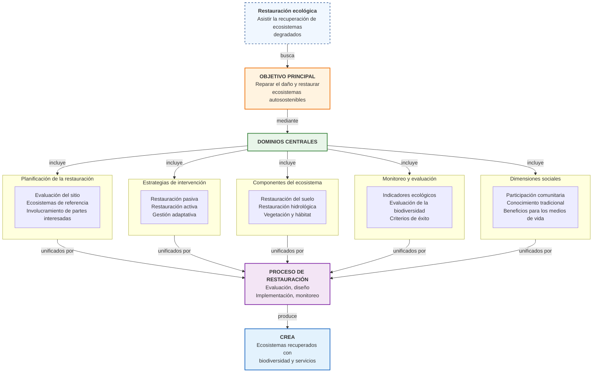

```mermaid
flowchart TD
    A[<b>Restauración ecológica</b><br>Asistir la recuperación de ecosistemas<br>degradados]:::title
    B[<b>OBJETIVO PRINCIPAL</b><br>Reparar el daño y restaurar<br>ecosistemas autosostenibles]:::objective
    C[<b>DOMINIOS CENTRALES</b>]:::domains
    
    subgraph D[Planificación de la restauración]
        D1[Evaluación del sitio<br>Ecosistemas de referencia<br>Involucramiento de partes interesadas]
    end
    
    subgraph E[Estrategias de intervención]
        E1[Restauración pasiva<br>Restauración activa<br>Gestión adaptativa]
    end
    
    subgraph F[Componentes del ecosistema]
        F1[Restauración del suelo<br>Restauración hidrológica<br>Vegetación y hábitat]
    end
    
    subgraph G[Monitoreo y evaluación]
        G1[Indicadores ecológicos<br>Evaluación de la biodiversidad<br>Criterios de éxito]
    end
    
    subgraph H[Dimensiones sociales]
        H1[Participación comunitaria<br>Conocimiento tradicional<br>Beneficios para los medios de vida]
    end
    
    I[<b>PROCESO DE RESTAURACIÓN</b><br>Evaluación, diseño<br>Implementación, monitoreo]:::process
    
    J[<b>CREA</b><br>Ecosistemas recuperados con<br>biodiversidad y servicios]:::outcome
    
    A -->|busca| B
    B -->|mediante| C
    C -->|incluye| D
    C -->|incluye| E
    C -->|incluye| F
    C -->|incluye| G
    C -->|incluye| H
    D & E & F & G & H -->|unificados por| I
    I -->|produce| J
    
    classDef title fill:#f0f7ff,stroke:#4a6fa5,stroke-width:2px,color:#333,stroke-dasharray: 5 5
    classDef objective fill:#fff3e0,stroke:#ef6c00,stroke-width:2px,color:#333
    classDef domains fill:#e8f5e9,stroke:#2e7d32,stroke-width:2px,color:#333
    classDef process fill:#f3e5f5,stroke:#7b1fa2,stroke-width:2px,color:#333
    classDef outcome fill:#e3f2fd,stroke:#1565c0,stroke-width:2px,color:#333
```
