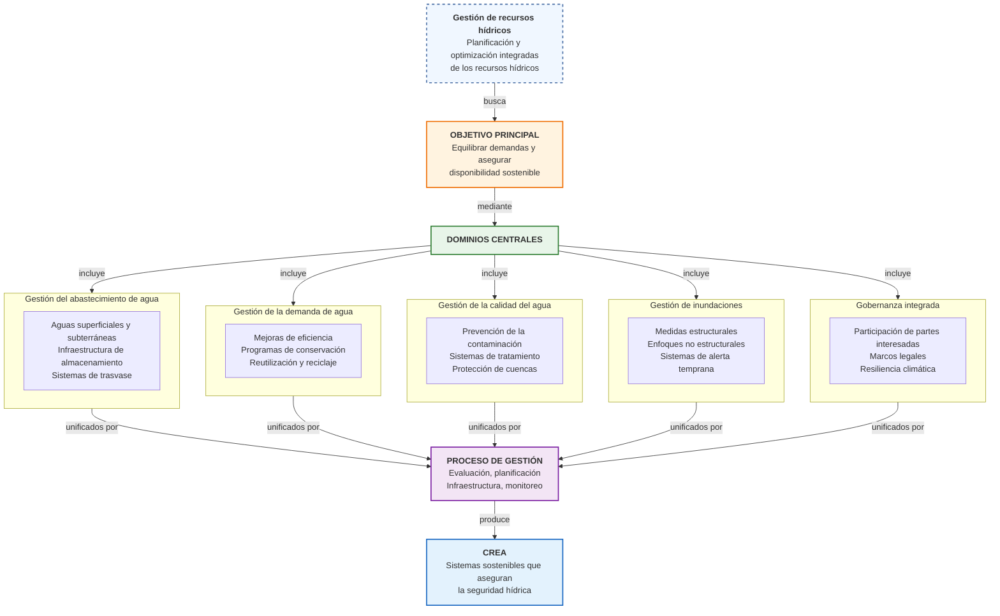

```mermaid
flowchart TD
    A[<b>Gestión de recursos hídricos</b><br>Planificación y optimización integradas<br>de los recursos hídricos]:::title
    B[<b>OBJETIVO PRINCIPAL</b><br>Equilibrar demandas y asegurar<br>disponibilidad sostenible]:::objective
    C[<b>DOMINIOS CENTRALES</b>]:::domains
    
    subgraph D[Gestión del abastecimiento de agua]
        D1[Aguas superficiales y subterráneas<br>Infraestructura de almacenamiento<br>Sistemas de trasvase]
    end
    
    subgraph E[Gestión de la demanda de agua]
        E1[Mejoras de eficiencia<br>Programas de conservación<br>Reutilización y reciclaje]
    end
    
    subgraph F[Gestión de la calidad del agua]
        F1[Prevención de la contaminación<br>Sistemas de tratamiento<br>Protección de cuencas]
    end
    
    subgraph G[Gestión de inundaciones]
        G1[Medidas estructurales<br>Enfoques no estructurales<br>Sistemas de alerta temprana]
    end
    
    subgraph H[Gobernanza integrada]
        H1[Participación de partes interesadas<br>Marcos legales<br>Resiliencia climática]
    end
    
    I[<b>PROCESO DE GESTIÓN</b><br>Evaluación, planificación<br>Infraestructura, monitoreo]:::process
    
    J[<b>CREA</b><br>Sistemas sostenibles que aseguran<br>la seguridad hídrica]:::outcome
    
    A -->|busca| B
    B -->|mediante| C
    C -->|incluye| D
    C -->|incluye| E
    C -->|incluye| F
    C -->|incluye| G
    C -->|incluye| H
    D & E & F & G & H -->|unificados por| I
    I -->|produce| J
    
    classDef title fill:#f0f7ff,stroke:#4a6fa5,stroke-width:2px,color:#333,stroke-dasharray: 5 5
    classDef objective fill:#fff3e0,stroke:#ef6c00,stroke-width:2px,color:#333
    classDef domains fill:#e8f5e9,stroke:#2e7d32,stroke-width:2px,color:#333
    classDef process fill:#f3e5f5,stroke:#7b1fa2,stroke-width:2px,color:#333
    classDef outcome fill:#e3f2fd,stroke:#1565c0,stroke-width:2px,color:#333
```
