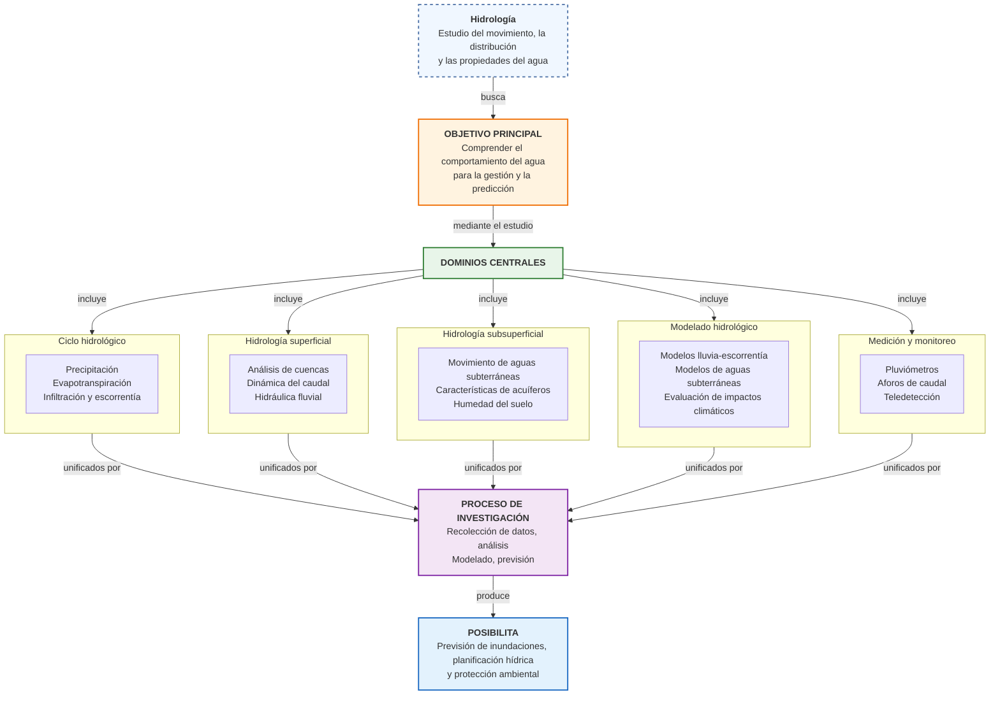

```mermaid
flowchart TD
    A[<b>Hidrología</b><br>Estudio del movimiento, la distribución<br>y las propiedades del agua]:::title
    B[<b>OBJETIVO PRINCIPAL</b><br>Comprender el comportamiento del agua<br>para la gestión y la predicción]:::objective
    C[<b>DOMINIOS CENTRALES</b>]:::domains
    
    subgraph D[Ciclo hidrológico]
        D1[Precipitación<br>Evapotranspiración<br>Infiltración y escorrentía]
    end
    
    subgraph E[Hidrología superficial]
        E1[Análisis de cuencas<br>Dinámica del caudal<br>Hidráulica fluvial]
    end
    
    subgraph F[Hidrología subsuperficial]
        F1[Movimiento de aguas subterráneas<br>Características de acuíferos<br>Humedad del suelo]
    end
    
    subgraph G[Modelado hidrológico]
        G1[Modelos lluvia-escorrentía<br>Modelos de aguas subterráneas<br>Evaluación de impactos climáticos]
    end
    
    subgraph H[Medición y monitoreo]
        H1[Pluviómetros<br>Aforos de caudal<br>Teledetección]
    end
    
    I[<b>PROCESO DE INVESTIGACIÓN</b><br>Recolección de datos, análisis<br>Modelado, previsión]:::process
    
    J[<b>POSIBILITA</b><br>Previsión de inundaciones, planificación hídrica<br>y protección ambiental]:::outcome
    
    A -->|busca| B
    B -->|mediante el estudio| C
    C -->|incluye| D
    C -->|incluye| E
    C -->|incluye| F
    C -->|incluye| G
    C -->|incluye| H
    D & E & F & G & H -->|unificados por| I
    I -->|produce| J
    
    classDef title fill:#f0f7ff,stroke:#4a6fa5,stroke-width:2px,color:#333,stroke-dasharray: 5 5
    classDef objective fill:#fff3e0,stroke:#ef6c00,stroke-width:2px,color:#333
    classDef domains fill:#e8f5e9,stroke:#2e7d32,stroke-width:2px,color:#333
    classDef process fill:#f3e5f5,stroke:#7b1fa2,stroke-width:2px,color:#333
    classDef outcome fill:#e3f2fd,stroke:#1565c0,stroke-width:2px,color:#333
```
