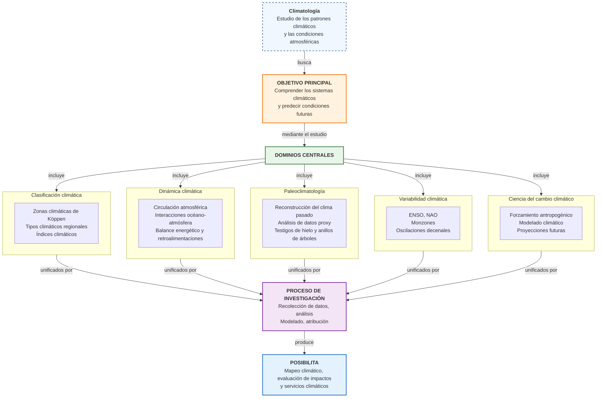

```mermaid
flowchart TD
    A[<b>Climatología</b><br>Estudio de los patrones climáticos<br>y las condiciones atmosféricas]:::title
    B[<b>OBJETIVO PRINCIPAL</b><br>Comprender los sistemas climáticos<br>y predecir condiciones futuras]:::objective
    C[<b>DOMINIOS CENTRALES</b>]:::domains
    
    subgraph D[Clasificación climática]
        D1[Zonas climáticas de Köppen<br>Tipos climáticos regionales<br>Índices climáticos]
    end
    
    subgraph E[Dinámica climática]
        E1[Circulación atmosférica<br>Interacciones océano-atmósfera<br>Balance energético y retroalimentaciones]
    end
    
    subgraph F[Paleoclimatología]
        F1[Reconstrucción del clima pasado<br>Análisis de datos proxy<br>Testigos de hielo y anillos de árboles]
    end
    
    subgraph G[Variabilidad climática]
        G1[ENSO, NAO<br>Monzones<br>Oscilaciones decenales]
    end
    
    subgraph H[Ciencia del cambio climático]
        H1[Forzamiento antropogénico<br>Modelado climático<br>Proyecciones futuras]
    end
    
    I[<b>PROCESO DE INVESTIGACIÓN</b><br>Recolección de datos, análisis<br>Modelado, atribución]:::process
    
    J[<b>POSIBILITA</b><br>Mapeo climático, evaluación de impactos<br>y servicios climáticos]:::outcome
    
    A -->|busca| B
    B -->|mediante el estudio| C
    C -->|incluye| D
    C -->|incluye| E
    C -->|incluye| F
    C -->|incluye| G
    C -->|incluye| H
    D & E & F & G & H -->|unificados por| I
    I -->|produce| J
    
    classDef title fill:#f0f7ff,stroke:#4a6fa5,stroke-width:2px,color:#333,stroke-dasharray: 5 5
    classDef objective fill:#fff3e0,stroke:#ef6c00,stroke-width:2px,color:#333
    classDef domains fill:#e8f5e9,stroke:#2e7d32,stroke-width:2px,color:#333
    classDef process fill:#f3e5f5,stroke:#7b1fa2,stroke-width:2px,color:#333
    classDef outcome fill:#e3f2fd,stroke:#1565c0,stroke-width:2px,color:#333
```
