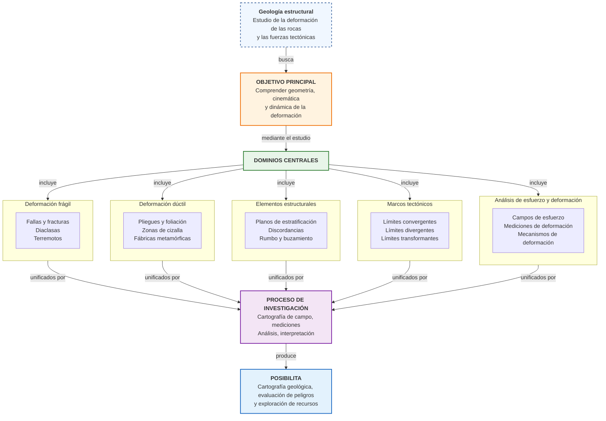

```mermaid
flowchart TD
    A[<b>Geología estructural</b><br>Estudio de la deformación de las rocas<br>y las fuerzas tectónicas]:::title
    B[<b>OBJETIVO PRINCIPAL</b><br>Comprender geometría, cinemática<br>y dinámica de la deformación]:::objective
    C[<b>DOMINIOS CENTRALES</b>]:::domains
    
    subgraph D[Deformación frágil]
        D1[Fallas y fracturas<br>Diaclasas<br>Terremotos]
    end
    
    subgraph E[Deformación dúctil]
        E1[Pliegues y foliación<br>Zonas de cizalla<br>Fábricas metamórficas]
    end
    
    subgraph F[Elementos estructurales]
        F1[Planos de estratificación<br>Discordancias<br>Rumbo y buzamiento]
    end
    
    subgraph G[Marcos tectónicos]
        G1[Límites convergentes<br>Límites divergentes<br>Límites transformantes]
    end
    
    subgraph H[Análisis de esfuerzo y deformación]
        H1[Campos de esfuerzo<br>Mediciones de deformación<br>Mecanismos de deformación]
    end
    
    I[<b>PROCESO DE INVESTIGACIÓN</b><br>Cartografía de campo, mediciones<br>Análisis, interpretación]:::process
    
    J[<b>POSIBILITA</b><br>Cartografía geológica, evaluación de peligros<br>y exploración de recursos]:::outcome
    
    A -->|busca| B
    B -->|mediante el estudio| C
    C -->|incluye| D
    C -->|incluye| E
    C -->|incluye| F
    C -->|incluye| G
    C -->|incluye| H
    D & E & F & G & H -->|unificados por| I
    I -->|produce| J
    
    classDef title fill:#f0f7ff,stroke:#4a6fa5,stroke-width:2px,color:#333,stroke-dasharray: 5 5
    classDef objective fill:#fff3e0,stroke:#ef6c00,stroke-width:2px,color:#333
    classDef domains fill:#e8f5e9,stroke:#2e7d32,stroke-width:2px,color:#333
    classDef process fill:#f3e5f5,stroke:#7b1fa2,stroke-width:2px,color:#333
    classDef outcome fill:#e3f2fd,stroke:#1565c0,stroke-width:2px,color:#333
```
