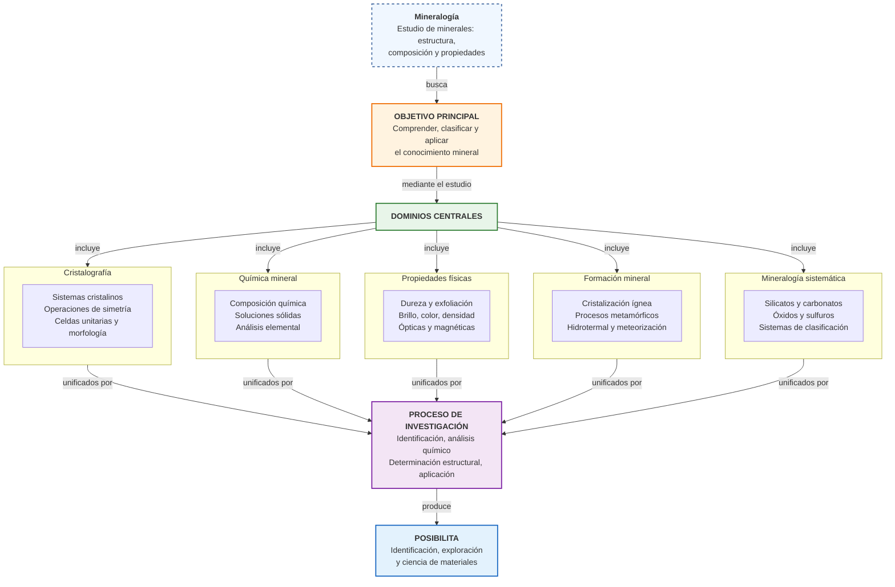

```mermaid
flowchart TD
    A[<b>Mineralogía</b><br>Estudio de minerales: estructura,<br>composición y propiedades]:::title
    B[<b>OBJETIVO PRINCIPAL</b><br>Comprender, clasificar y aplicar<br>el conocimiento mineral]:::objective
    C[<b>DOMINIOS CENTRALES</b>]:::domains
    
    subgraph D[Cristalografía]
        D1[Sistemas cristalinos<br>Operaciones de simetría<br>Celdas unitarias y morfología]
    end
    
    subgraph E[Química mineral]
        E1[Composición química<br>Soluciones sólidas<br>Análisis elemental]
    end
    
    subgraph F[Propiedades físicas]
        F1[Dureza y exfoliación<br>Brillo, color, densidad<br>Ópticas y magnéticas]
    end
    
    subgraph G[Formación mineral]
        G1[Cristalización ígnea<br>Procesos metamórficos<br>Hidrotermal y meteorización]
    end
    
    subgraph H[Mineralogía sistemática]
        H1[Silicatos y carbonatos<br>Óxidos y sulfuros<br>Sistemas de clasificación]
    end
    
    I[<b>PROCESO DE INVESTIGACIÓN</b><br>Identificación, análisis químico<br>Determinación estructural, aplicación]:::process
    
    J[<b>POSIBILITA</b><br>Identificación, exploración<br>y ciencia de materiales]:::outcome
    
    A -->|busca| B
    B -->|mediante el estudio| C
    C -->|incluye| D
    C -->|incluye| E
    C -->|incluye| F
    C -->|incluye| G
    C -->|incluye| H
    D & E & F & G & H -->|unificados por| I
    I -->|produce| J
    
    classDef title fill:#f0f7ff,stroke:#4a6fa5,stroke-width:2px,color:#333,stroke-dasharray: 5 5
    classDef objective fill:#fff3e0,stroke:#ef6c00,stroke-width:2px,color:#333
    classDef domains fill:#e8f5e9,stroke:#2e7d32,stroke-width:2px,color:#333
    classDef process fill:#f3e5f5,stroke:#7b1fa2,stroke-width:2px,color:#333
    classDef outcome fill:#e3f2fd,stroke:#1565c0,stroke-width:2px,color:#333
```
