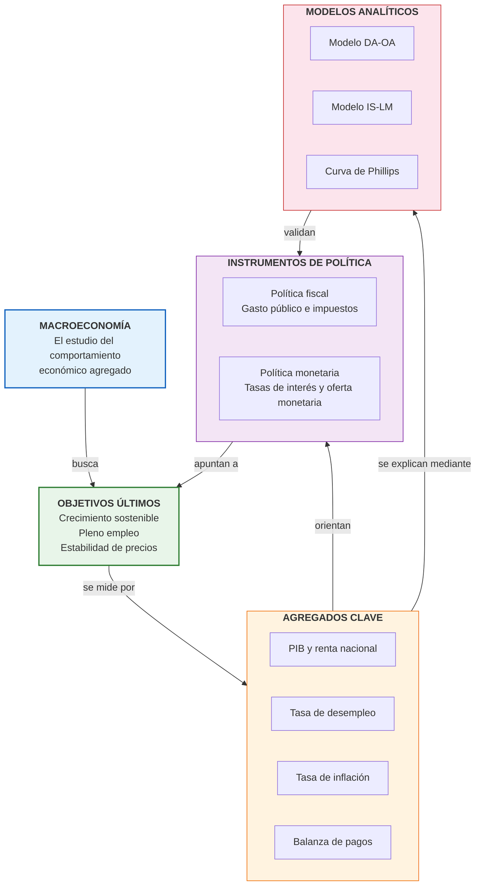

```mermaid
flowchart TD
    A[<b>MACROECONOMÍA</b><br>El estudio del comportamiento<br>económico agregado]:::title
    B[<b>OBJETIVOS ÚLTIMOS</b><br>Crecimiento sostenible<br>Pleno empleo<br>Estabilidad de precios]:::goals
    subgraph aggregates [<b>AGREGADOS CLAVE</b>]
        C1[PIB y renta nacional]
        C2[Tasa de desempleo]
        C3[Tasa de inflación]
        C4[Balanza de pagos]
    end
    subgraph policies [<b>INSTRUMENTOS DE POLÍTICA</b>]
        D1[Política fiscal<br>Gasto público e impuestos]
        D2[Política monetaria<br>Tasas de interés y oferta monetaria]
    end
    subgraph models [<b>MODELOS ANALÍTICOS</b>]
        E1[Modelo DA-OA]
        E2[Modelo IS-LM]
        E3[Curva de Phillips]
    end
    A -->|busca| B
    B -->|se mide por| aggregates
    aggregates -->|orientan| policies
    policies -->|apuntan a| B
    aggregates -->|se explican mediante| models
    models -->|validan| policies
    classDef title fill:#E3F2FD,stroke:#1565C0,stroke-width:2px,color:#333
    classDef goals fill:#E8F5E9,stroke:#2E7D32,stroke-width:2px,color:#333
    style aggregates fill:#FFF3E0,stroke:#EF6C00,stroke-width:1px,color:#333
    style policies fill:#F3E5F5,stroke:#7B1FA2,stroke-width:1px,color:#333
    style models fill:#FCE4EC,stroke:#C62828,stroke-width:1px,color:#333
```
