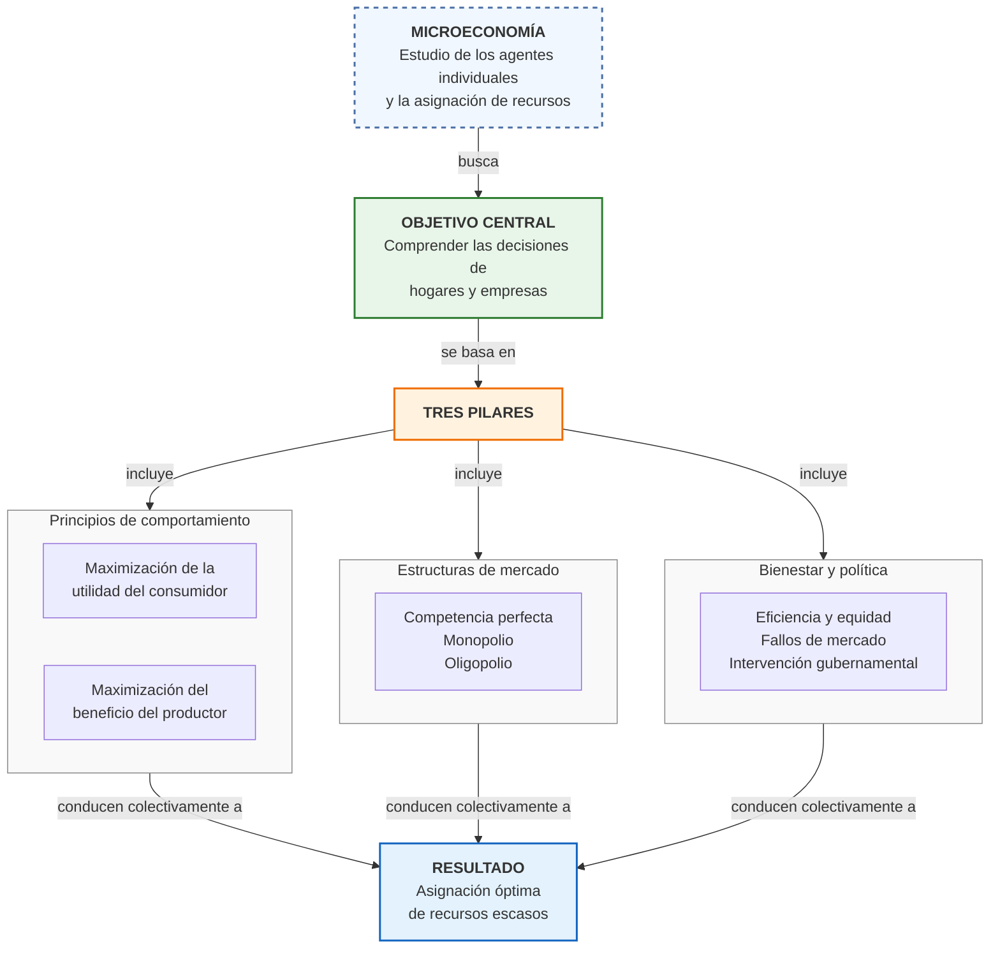

```mermaid
flowchart TD
    A[<b>MICROECONOMÍA</b><br>Estudio de los agentes individuales<br>y la asignación de recursos]:::title
    B[<b>OBJETIVO CENTRAL</b><br>Comprender las decisiones de<br>hogares y empresas]:::objective
    C[<b>TRES PILARES</b>]:::pillars
    subgraph principles [Principios de comportamiento]
        C1[Maximización de la<br>utilidad del consumidor]
        C2[Maximización del<br>beneficio del productor]
    end
    subgraph structures [Estructuras de mercado]
        C3[Competencia perfecta<br>Monopolio<br>Oligopolio]
    end
    subgraph welfare [Bienestar y política]
        C4[Eficiencia y equidad<br>Fallos de mercado<br>Intervención gubernamental]
    end
    D[<b>RESULTADO</b><br>Asignación óptima<br>de recursos escasos]:::outcome
    A -->|busca| B
    B -->|se basa en| C
    C -->|incluye| principles
    C -->|incluye| structures
    C -->|incluye| welfare
    principles & structures & welfare -->|conducen colectivamente a| D
    classDef title fill:#f0f7ff,stroke:#4a6fa5,stroke-width:2px,color:#333,stroke-dasharray:5 5
    classDef objective fill:#e8f5e9,stroke:#2e7d32,stroke-width:2px,color:#333
    classDef pillars fill:#fff3e0,stroke:#ef6c00,stroke-width:2px,color:#333
    classDef outcome fill:#e3f2fd,stroke:#1565c0,stroke-width:2px,color:#333
    style principles fill:#f9f9f9,stroke:#888,stroke-width:1px,color:#333
    style structures fill:#f9f9f9,stroke:#888,stroke-width:1px,color:#333
    style welfare fill:#f9f9f9,stroke:#888,stroke-width:1px,color:#333
```
