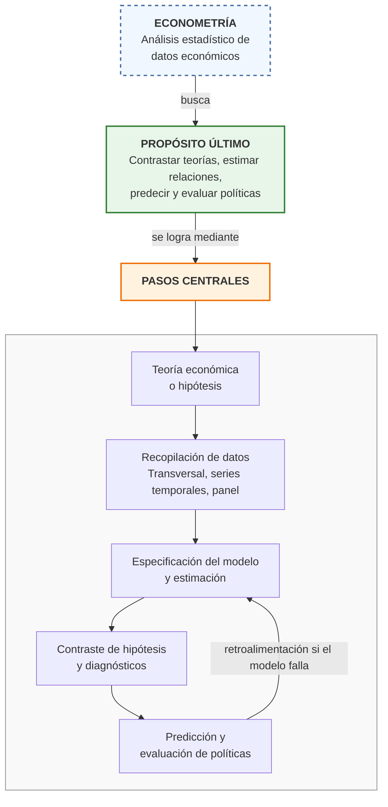

```mermaid
flowchart TD
    A[<b>ECONOMETRÍA</b><br>Análisis estadístico de<br>datos económicos]:::title
    B[<b>PROPÓSITO ÚLTIMO</b><br>Contrastar teorías, estimar relaciones,<br>predecir y evaluar políticas]:::purpose
    C[<b>PASOS CENTRALES</b>]:::steps
    subgraph steps [ ]
        D[Teoría económica<br>o hipótesis]
        E[Recopilación de datos<br>Transversal, series temporales, panel]
        F[Especificación del modelo<br>y estimación]
        G[Contraste de hipótesis<br>y diagnósticos]
        H[Predicción y<br>evaluación de políticas]
    end
    A -->|busca| B
    B -->|se logra mediante| C
    C --> D
    D --> E
    E --> F
    F --> G
    G --> H
    H -->|retroalimentación si el modelo falla| F
    classDef title fill:#f0f7ff,stroke:#4a6fa5,stroke-width:2px,color:#333,stroke-dasharray: 5 5
    classDef purpose fill:#e8f5e9,stroke:#2e7d32,stroke-width:2px,color:#333
    classDef steps fill:#fff3e0,stroke:#ef6c00,stroke-width:2px,color:#333
    style steps fill:#f9f9f9,stroke:#888,stroke-width:1px,color:#333
```
