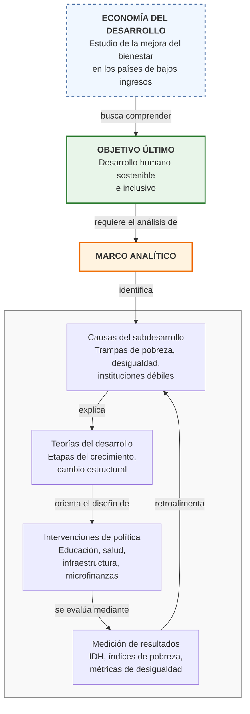

```mermaid
flowchart TD
    A[<b>ECONOMÍA DEL DESARROLLO</b><br>Estudio de la mejora del bienestar<br>en los países de bajos ingresos]:::title
    B[<b>OBJETIVO ÚLTIMO</b><br>Desarrollo humano sostenible<br>e inclusivo]:::goal
    C[<b>MARCO ANALÍTICO</b>]:::framework
    subgraph framework [ ]
        D[Causas del subdesarrollo<br>Trampas de pobreza, desigualdad,<br>instituciones débiles]
        E[Teorías del desarrollo<br>Etapas del crecimiento,<br>cambio estructural]
        F[Intervenciones de política<br>Educación, salud,<br>infraestructura, microfinanzas]
        G[Medición de resultados<br>IDH, índices de pobreza,<br>métricas de desigualdad]
    end
    A -->|busca comprender| B
    B -->|requiere el análisis de| C
    C -->|identifica| D
    D -->|explica| E
    E -->|orienta el diseño de| F
    F -->|se evalúa mediante| G
    G -->|retroalimenta| D
    classDef title fill:#f0f7ff,stroke:#4a6fa5,stroke-width:2px,color:#333,stroke-dasharray: 5 5
    classDef goal fill:#e8f5e9,stroke:#2e7d32,stroke-width:2px,color:#333
    classDef framework fill:#fff3e0,stroke:#ef6c00,stroke-width:2px,color:#333
    style framework fill:#f9f9f9,stroke:#888,stroke-width:1px,color:#333
```
