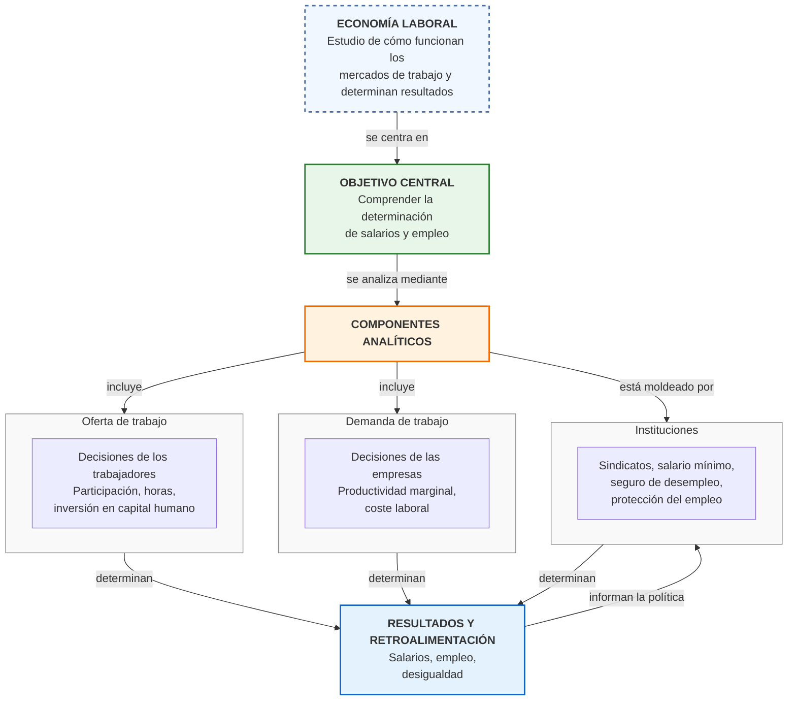

```mermaid
flowchart TD
    A[<b>ECONOMÍA LABORAL</b><br>Estudio de cómo funcionan los<br>mercados de trabajo y determinan resultados]:::title
    B[<b>OBJETIVO CENTRAL</b><br>Comprender la determinación<br>de salarios y empleo]:::objective
    C[<b>COMPONENTES ANALÍTICOS</b>]:::components
    subgraph supply [Oferta de trabajo]
        C1[Decisiones de los trabajadores<br>Participación, horas,<br>inversión en capital humano]
    end
    subgraph demand [Demanda de trabajo]
        C2[Decisiones de las empresas<br>Productividad marginal,<br>coste laboral]
    end
    subgraph institutions [Instituciones]
        C3[Sindicatos, salario mínimo,<br>seguro de desempleo,<br>protección del empleo]
    end
    D[<b>RESULTADOS Y RETROALIMENTACIÓN</b><br>Salarios, empleo,<br>desigualdad]:::outcome
    A -->|se centra en| B
    B -->|se analiza mediante| C
    C -->|incluye| supply
    C -->|incluye| demand
    C -->|está moldeado por| institutions
    supply & demand & institutions -->|determinan| D
    D -->|informan la política| institutions
    classDef title fill:#f0f7ff,stroke:#4a6fa5,stroke-width:2px,color:#333,stroke-dasharray:5 5
    classDef objective fill:#e8f5e9,stroke:#2e7d32,stroke-width:2px,color:#333
    classDef components fill:#fff3e0,stroke:#ef6c00,stroke-width:2px,color:#333
    classDef outcome fill:#e3f2fd,stroke:#1565c0,stroke-width:2px,color:#333
    style supply fill:#f9f9f9,stroke:#888,stroke-width:1px,color:#333
    style demand fill:#f9f9f9,stroke:#888,stroke-width:1px,color:#333
    style institutions fill:#f9f9f9,stroke:#888,stroke-width:1px,color:#333
```
