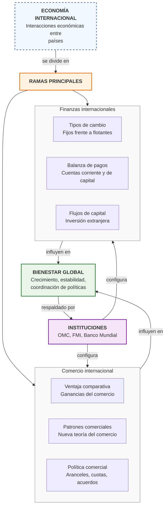

```mermaid
flowchart TD
    A[<b>ECONOMÍA INTERNACIONAL</b><br>Interacciones económicas entre<br>países]:::title
    B[<b>RAMAS PRINCIPALES</b>]:::branches
    subgraph trade [Comercio internacional]
        C1[Ventaja comparativa<br>Ganancias del comercio]
        C2[Patrones comerciales<br>Nueva teoría del comercio]
        C3[Política comercial<br>Aranceles, cuotas, acuerdos]
    end
    subgraph finance [Finanzas internacionales]
        C4[Tipos de cambio<br>Fijos frente a flotantes]
        C5[Balanza de pagos<br>Cuentas corriente y de capital]
        C6[Flujos de capital<br>Inversión extranjera]
    end
    D[<b>BIENESTAR GLOBAL</b><br>Crecimiento, estabilidad,<br>coordinación de políticas]:::welfare
    E[<b>INSTITUCIONES</b><br>OMC, FMI, Banco Mundial]:::institutions
    A -->|se divide en| B
    B --> trade
    B --> finance
    trade & finance -->|influyen en| D
    D -->|respaldado por| E
    E -->|configura| trade
    E -->|configura| finance
    classDef title fill:#f0f7ff,stroke:#4a6fa5,stroke-width:2px,color:#333,stroke-dasharray:5 5
    classDef branches fill:#fff3e0,stroke:#ef6c00,stroke-width:2px,color:#333
    classDef welfare fill:#e8f5e9,stroke:#2e7d32,stroke-width:2px,color:#333
    classDef institutions fill:#f3e5f5,stroke:#7b1fa2,stroke-width:2px,color:#333
    style trade fill:#f9f9f9,stroke:#888,stroke-width:1px,color:#333
    style finance fill:#f9f9f9,stroke:#888,stroke-width:1px,color:#333
```
