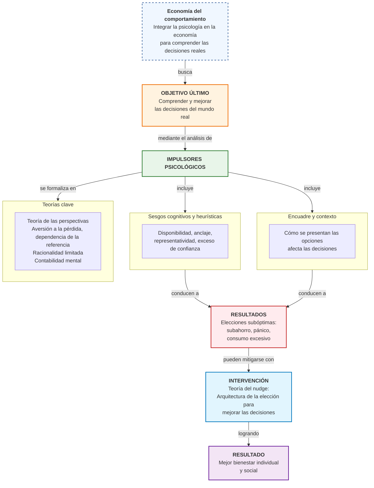

```mermaid
flowchart TD
    A[<b>Economía del comportamiento</b><br>Integrar la psicología en la economía<br>para comprender las decisiones reales]:::titulo
    B[<b>OBJETIVO ÚLTIMO</b><br>Comprender y mejorar<br>las decisiones del mundo real]:::goal
    C[<b>IMPULSORES PSICOLÓGICOS</b>]:::drivers
    subgraph D[Sesgos cognitivos y heurísticas]
        D1[Disponibilidad, anclaje,<br>representatividad, exceso de confianza]
    end
    subgraph E[Encuadre y contexto]
        E1[Cómo se presentan las opciones<br>afecta las decisiones]
    end
    subgraph F[Teorías clave]
        F1[Teoría de las perspectivas<br>Aversión a la pérdida, dependencia de la referencia<br>Racionalidad limitada<br>Contabilidad mental]
    end
    G[<b>RESULTADOS</b><br>Elecciones subóptimas:<br>subahorro, pánico,<br>consumo excesivo]:::outcomes
    H[<b>INTERVENCIÓN</b><br>Teoría del nudge:<br>Arquitectura de la elección para<br>mejorar las decisiones]:::intervention
    I[<b>RESULTADO</b><br>Mejor bienestar individual<br>y social]:::result

    A -->|busca| B
    B -->|mediante el análisis de| C
    C -->|incluye| D
    C -->|incluye| E
    C -->|se formaliza en| F
    D & E -->|conducen a| G
    G -->|pueden mitigarse con| H
    H -->|logrando| I

    classDef titulo fill:#f0f7ff,stroke:#4a6fa5,stroke-width:2px,color:#333,stroke-dasharray: 5 5
    classDef goal fill:#fff3e0,stroke:#ef6c00,stroke-width:2px,color:#333
    classDef drivers fill:#e8f5e9,stroke:#2e7d32,stroke-width:2px,color:#333
    classDef outcomes fill:#ffebee,stroke:#c62828,stroke-width:2px,color:#333
    classDef intervention fill:#e1f5fe,stroke:#0277bd,stroke-width:2px,color:#333
    classDef result fill:#f3e5f5,stroke:#6a1b9a,stroke-width:2px,color:#333
```
