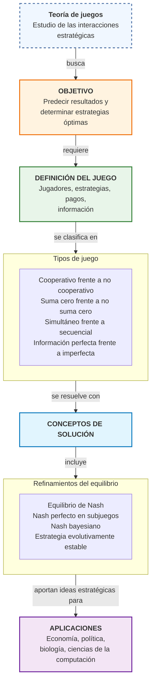

```mermaid
flowchart TD
    A[<b>Teoría de juegos</b><br>Estudio de las interacciones<br>estratégicas]:::titulo
    B[<b>OBJETIVO</b><br>Predecir resultados y<br>determinar estrategias óptimas]:::goal
    C[<b>DEFINICIÓN DEL JUEGO</b><br>Jugadores, estrategias, pagos,<br>información]:::definition
    subgraph D[Tipos de juego]
        D1[Cooperativo frente a no cooperativo<br>Suma cero frente a no suma cero<br>Simultáneo frente a secuencial<br>Información perfecta frente a imperfecta]
    end
    E[<b>CONCEPTOS DE SOLUCIÓN</b>]:::solutions
    subgraph F[Refinamientos del equilibrio]
        F1[Equilibrio de Nash<br>Nash perfecto en subjuegos<br>Nash bayesiano<br>Estrategia evolutivamente estable]
    end
    G[<b>APLICACIONES</b><br>Economía, política,<br>biología, ciencias de la computación]:::applications

    A -->|busca| B
    B -->|requiere| C
    C -->|se clasifica en| D
    D -->|se resuelve con| E
    E -->|incluye| F
    F -->|aportan ideas estratégicas para| G

    classDef titulo fill:#f0f7ff,stroke:#4a6fa5,stroke-width:2px,color:#333,stroke-dasharray: 5 5
    classDef goal fill:#fff3e0,stroke:#ef6c00,stroke-width:2px,color:#333
    classDef definition fill:#e8f5e9,stroke:#2e7d32,stroke-width:2px,color:#333
    classDef solutions fill:#e1f5fe,stroke:#0277bd,stroke-width:2px,color:#333
    classDef applications fill:#f3e5f5,stroke:#6a1b9a,stroke-width:2px,color:#333
```
