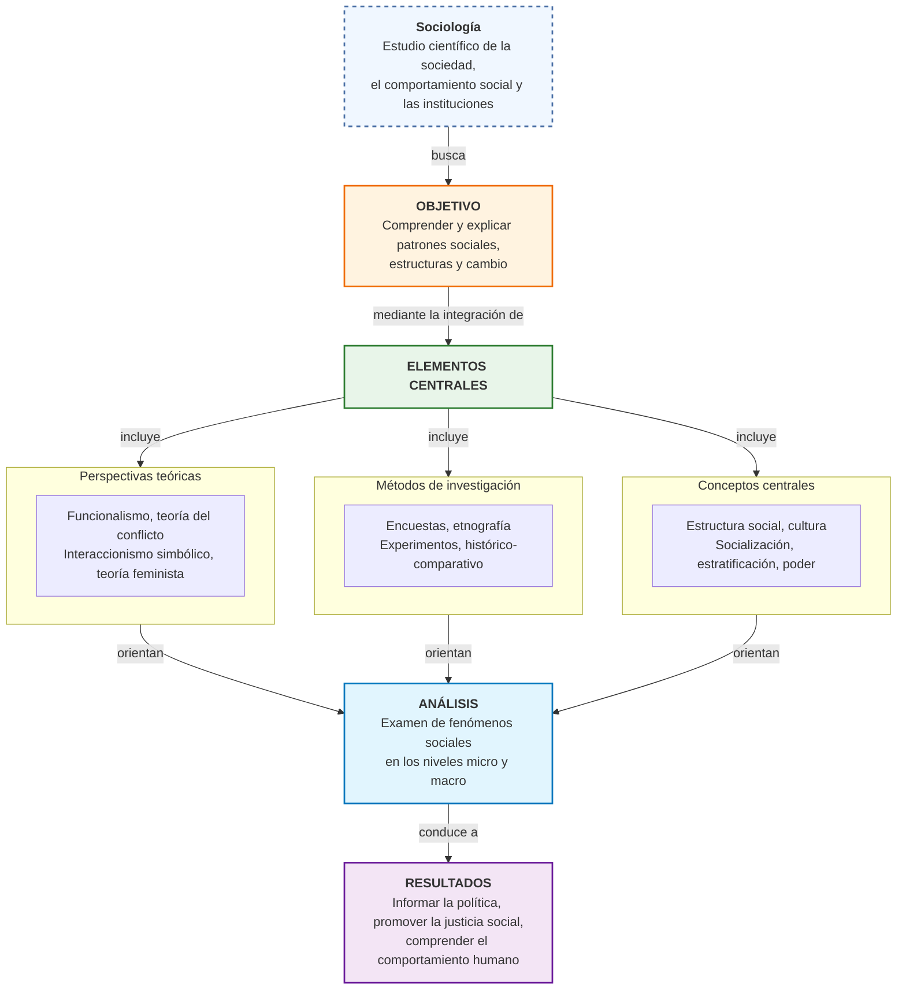

```mermaid
flowchart TD
    A[<b>Sociología</b><br>Estudio científico de la sociedad,<br>el comportamiento social y las instituciones]:::title
    B[<b>OBJETIVO</b><br>Comprender y explicar patrones sociales,<br>estructuras y cambio]:::goal
    C[<b>ELEMENTOS CENTRALES</b>]:::core
    subgraph D[Perspectivas teóricas]
        D1[Funcionalismo, teoría del conflicto<br>Interaccionismo simbólico, teoría feminista]
    end
    subgraph E[Métodos de investigación]
        E1[Encuestas, etnografía<br>Experimentos, histórico-comparativo]
    end
    subgraph F[Conceptos centrales]
        F1[Estructura social, cultura<br>Socialización, estratificación, poder]
    end
    G[<b>ANÁLISIS</b><br>Examen de fenómenos sociales<br>en los niveles micro y macro]:::analysis
    H[<b>RESULTADOS</b><br>Informar la política, promover la justicia social,<br>comprender el comportamiento humano]:::outcome

    A -->|busca| B
    B -->|mediante la integración de| C
    C -->|incluye| D
    C -->|incluye| E
    C -->|incluye| F
    D & E & F -->|orientan| G
    G -->|conduce a| H

    classDef title fill:#f0f7ff,stroke:#4a6fa5,stroke-width:2px,color:#333,stroke-dasharray: 5 5
    classDef goal fill:#fff3e0,stroke:#ef6c00,stroke-width:2px,color:#333
    classDef core fill:#e8f5e9,stroke:#2e7d32,stroke-width:2px,color:#333
    classDef analysis fill:#e1f5fe,stroke:#0277bd,stroke-width:2px,color:#333
    classDef outcome fill:#f3e5f5,stroke:#6a1b9a,stroke-width:2px,color:#333
```
