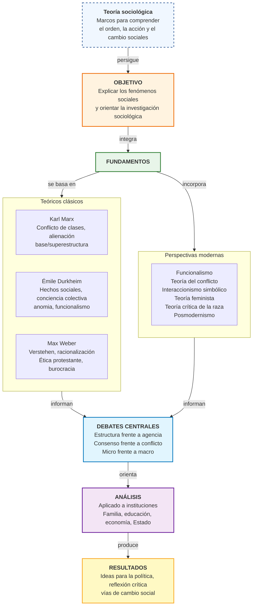

```mermaid
flowchart TD
    A[<b>Teoría sociológica</b><br>Marcos para comprender<br>el orden, la acción y el cambio sociales]:::title
    B[<b>OBJETIVO</b><br>Explicar los fenómenos sociales<br>y orientar la investigación sociológica]:::goal
    C[<b>FUNDAMENTOS</b>]:::foundations
    subgraph D[Teóricos clásicos]
        D1[Karl Marx<br>Conflicto de clases, alienación<br>base/superestructura]
        D2[Émile Durkheim<br>Hechos sociales, conciencia colectiva<br>anomia, funcionalismo]
        D3[Max Weber<br>Verstehen, racionalización<br>Ética protestante, burocracia]
    end
    subgraph E[Perspectivas modernas]
        E1[Funcionalismo<br>Teoría del conflicto<br>Interaccionismo simbólico<br>Teoría feminista<br>Teoría crítica de la raza<br>Posmodernismo]
    end
    F[<b>DEBATES CENTRALES</b><br>Estructura frente a agencia<br>Consenso frente a conflicto<br>Micro frente a macro]:::debates
    G[<b>ANÁLISIS</b><br>Aplicado a instituciones<br>Familia, educación, economía, Estado]:::analysis
    H[<b>RESULTADOS</b><br>Ideas para la política, reflexión crítica<br>vías de cambio social]:::outcome

    A -->|persigue| B
    B -->|integra| C
    C -->|se basa en| D
    C -->|incorpora| E
    D & E -->|informan| F
    F -->|orienta| G
    G -->|produce| H

    classDef title fill:#f0f7ff,stroke:#4a6fa5,stroke-width:2px,color:#333,stroke-dasharray: 5 5
    classDef goal fill:#fff3e0,stroke:#ef6c00,stroke-width:2px,color:#333
    classDef foundations fill:#e8f5e9,stroke:#2e7d32,stroke-width:2px,color:#333
    classDef debates fill:#e1f5fe,stroke:#0277bd,stroke-width:2px,color:#333
    classDef analysis fill:#f3e5f5,stroke:#6a1b9a,stroke-width:2px,color:#333
    classDef outcome fill:#fff9c4,stroke:#f9a825,stroke-width:2px,color:#333
```
