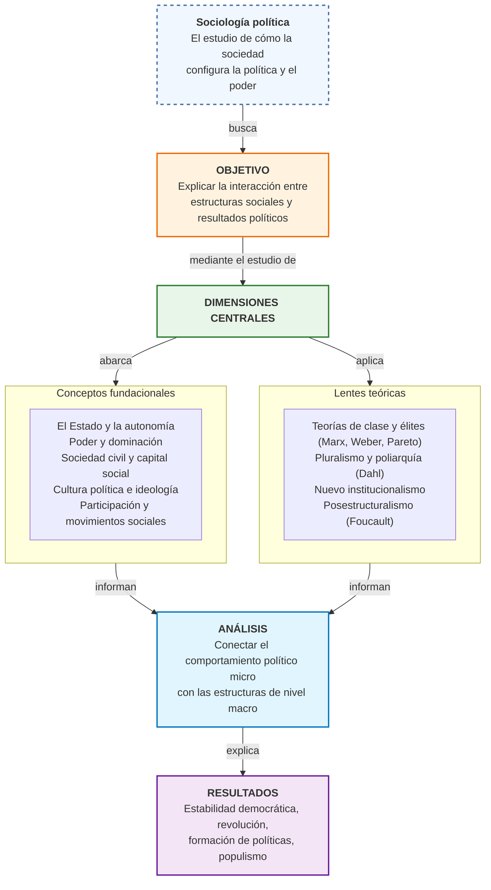

```mermaid
flowchart TD
    A[<b>Sociología política</b><br>El estudio de cómo la sociedad<br>configura la política y el poder]:::title
    B[<b>OBJETIVO</b><br>Explicar la interacción entre<br>estructuras sociales y resultados políticos]:::goal
    C[<b>DIMENSIONES CENTRALES</b>]:::dimensions
    subgraph D[Conceptos fundacionales]
        D1[El Estado y la autonomía<br>Poder y dominación<br>Sociedad civil y capital social<br>Cultura política e ideología<br>Participación y movimientos sociales]
    end
    subgraph E[Lentes teóricas]
        E1["Teorías de clase y élites (Marx, Weber, Pareto)<br>Pluralismo y poliarquía (Dahl)<br>Nuevo institucionalismo<br>Posestructuralismo (Foucault)"]
    end
    F[<b>ANÁLISIS</b><br>Conectar el comportamiento político micro<br>con las estructuras de nivel macro]:::analysis
    G[<b>RESULTADOS</b><br>Estabilidad democrática, revolución,<br>formación de políticas, populismo]:::outcome

    A -->|busca| B
    B -->|mediante el estudio de| C
    C -->|abarca| D
    C -->|aplica| E
    D & E -->|informan| F
    F -->|explica| G

    classDef title fill:#f0f7ff,stroke:#4a6fa5,stroke-width:2px,color:#333,stroke-dasharray: 5 5
    classDef goal fill:#fff3e0,stroke:#ef6c00,stroke-width:2px,color:#333
    classDef dimensions fill:#e8f5e9,stroke:#2e7d32,stroke-width:2px,color:#333
    classDef analysis fill:#e1f5fe,stroke:#0277bd,stroke-width:2px,color:#333
    classDef outcome fill:#f3e5f5,stroke:#6a1b9a,stroke-width:2px,color:#333
```
