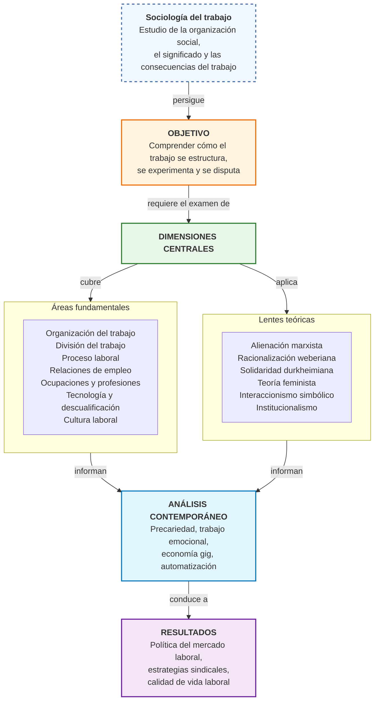

```mermaid
flowchart TD
    A[<b>Sociología del trabajo</b><br>Estudio de la organización social,<br>el significado y las consecuencias del trabajo]:::title
    B[<b>OBJETIVO</b><br>Comprender cómo el trabajo se estructura,<br>se experimenta y se disputa]:::goal
    C[<b>DIMENSIONES CENTRALES</b>]:::dimensions
    subgraph D[Áreas fundamentales]
        D1[Organización del trabajo<br>División del trabajo<br>Proceso laboral<br>Relaciones de empleo<br>Ocupaciones y profesiones<br>Tecnología y descualificación<br>Cultura laboral]
    end
    subgraph E[Lentes teóricas]
        E1[Alienación marxista<br>Racionalización weberiana<br>Solidaridad durkheimiana<br>Teoría feminista<br>Interaccionismo simbólico<br>Institucionalismo]
    end
    F[<b>ANÁLISIS CONTEMPORÁNEO</b><br>Precariedad, trabajo emocional,<br>economía gig, automatización]:::analysis
    G[<b>RESULTADOS</b><br>Política del mercado laboral,<br>estrategias sindicales,<br>calidad de vida laboral]:::outcome

    A -->|persigue| B
    B -->|requiere el examen de| C
    C -->|cubre| D
    C -->|aplica| E
    D & E -->|informan| F
    F -->|conduce a| G

    classDef title fill:#f0f7ff,stroke:#4a6fa5,stroke-width:2px,color:#333,stroke-dasharray: 5 5
    classDef goal fill:#fff3e0,stroke:#ef6c00,stroke-width:2px,color:#333
    classDef dimensions fill:#e8f5e9,stroke:#2e7d32,stroke-width:2px,color:#333
    classDef analysis fill:#e1f5fe,stroke:#0277bd,stroke-width:2px,color:#333
    classDef outcome fill:#f3e5f5,stroke:#6a1b9a,stroke-width:2px,color:#333
```
