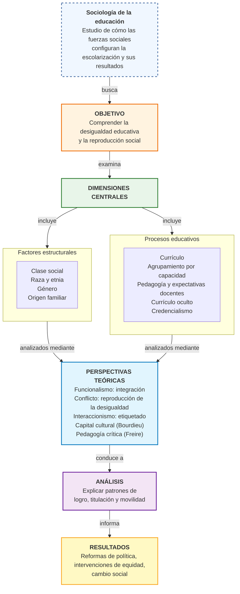

```mermaid
flowchart TD
    A[<b>Sociología de la educación</b><br>Estudio de cómo las fuerzas sociales<br>configuran la escolarización y sus resultados]:::title
    B[<b>OBJETIVO</b><br>Comprender la desigualdad educativa<br>y la reproducción social]:::goal
    C[<b>DIMENSIONES CENTRALES</b>]:::dimensions
    subgraph D[Factores estructurales]
        D1[Clase social<br>Raza y etnia<br>Género<br>Origen familiar]
    end
    subgraph E[Procesos educativos]
        E1[Currículo<br>Agrupamiento por capacidad<br>Pedagogía y expectativas docentes<br>Currículo oculto<br>Credencialismo]
    end
    F["<b>PERSPECTIVAS TEÓRICAS</b><br>Funcionalismo: integración<br>Conflicto: reproducción de la desigualdad<br>Interaccionismo: etiquetado<br>Capital cultural (Bourdieu)<br>Pedagogía crítica (Freire)"]:::theory
    G[<b>ANÁLISIS</b><br>Explicar patrones de<br>logro, titulación y movilidad]:::analysis
    H[<b>RESULTADOS</b><br>Reformas de política, intervenciones de equidad,<br>cambio social]:::outcome

    A -->|busca| B
    B -->|examina| C
    C -->|incluye| D
    C -->|incluye| E
    D & E -->|analizados mediante| F
    F -->|conduce a| G
    G -->|informa| H

    classDef title fill:#f0f7ff,stroke:#4a6fa5,stroke-width:2px,color:#333,stroke-dasharray: 5 5
    classDef goal fill:#fff3e0,stroke:#ef6c00,stroke-width:2px,color:#333
    classDef dimensions fill:#e8f5e9,stroke:#2e7d32,stroke-width:2px,color:#333
    classDef theory fill:#e1f5fe,stroke:#0277bd,stroke-width:2px,color:#333
    classDef analysis fill:#f3e5f5,stroke:#6a1b9a,stroke-width:2px,color:#333
    classDef outcome fill:#fff9c4,stroke:#f9a825,stroke-width:2px,color:#333
```
