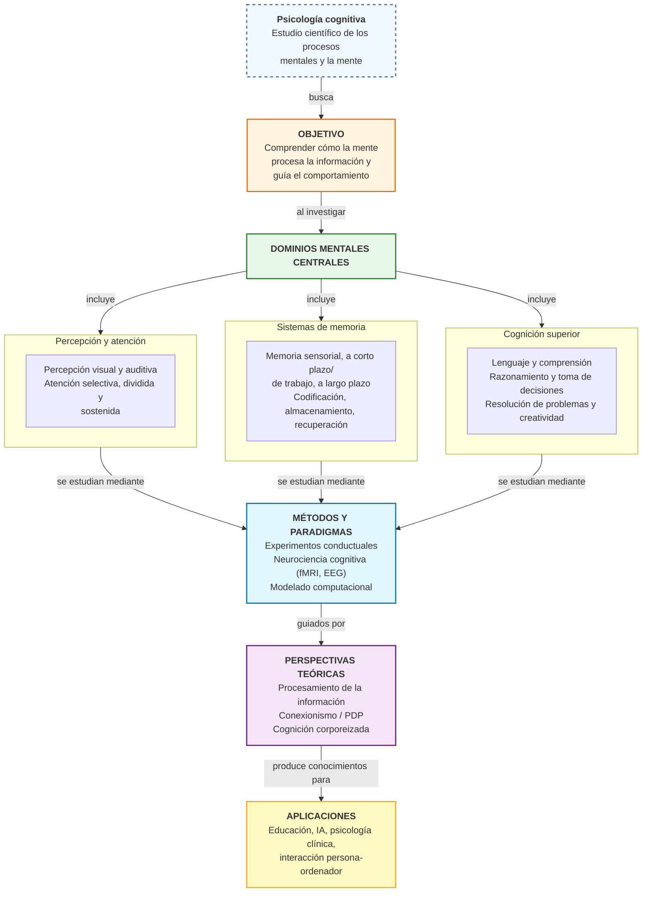

```mermaid
flowchart TD
    A[<b>Psicología cognitiva</b><br>Estudio científico de los procesos<br>mentales y la mente]:::title
    B[<b>OBJETIVO</b><br>Comprender cómo la mente<br>procesa la información y<br>guía el comportamiento]:::goal
    C[<b>DOMINIOS MENTALES CENTRALES</b>]:::domains
    subgraph D[Percepción y atención]
        D1[Percepción visual y auditiva<br>Atención selectiva, dividida y<br>sostenida]
    end
    subgraph E[Sistemas de memoria]
        E1[Memoria sensorial, a corto plazo/<br>de trabajo, a largo plazo<br>Codificación, almacenamiento, recuperación]
    end
    subgraph F[Cognición superior]
        F1[Lenguaje y comprensión<br>Razonamiento y toma de decisiones<br>Resolución de problemas y creatividad]
    end
    G["<b>MÉTODOS Y PARADIGMAS</b><br>Experimentos conductuales<br>Neurociencia cognitiva (fMRI, EEG)<br>Modelado computacional"]:::methods
    H[<b>PERSPECTIVAS TEÓRICAS</b><br>Procesamiento de la información<br>Conexionismo / PDP<br>Cognición corporeizada]:::theory
    I[<b>APLICACIONES</b><br>Educación, IA, psicología clínica,<br>interacción persona-ordenador]:::outcome

    A -->|busca| B
    B -->|al investigar| C
    C -->|incluye| D
    C -->|incluye| E
    C -->|incluye| F
    D & E & F -->|se estudian mediante| G
    G -->|guiados por| H
    H -->|produce conocimientos para| I

    classDef title fill:#f0f7ff,stroke:#4a6fa5,stroke-width:2px,color:#333,stroke-dasharray: 5 5
    classDef goal fill:#fff3e0,stroke:#ef6c00,stroke-width:2px,color:#333
    classDef domains fill:#e8f5e9,stroke:#2e7d32,stroke-width:2px,color:#333
    classDef methods fill:#e1f5fe,stroke:#0277bd,stroke-width:2px,color:#333
    classDef theory fill:#f3e5f5,stroke:#6a1b9a,stroke-width:2px,color:#333
    classDef outcome fill:#fff9c4,stroke:#f9a825,stroke-width:2px,color:#333
```
