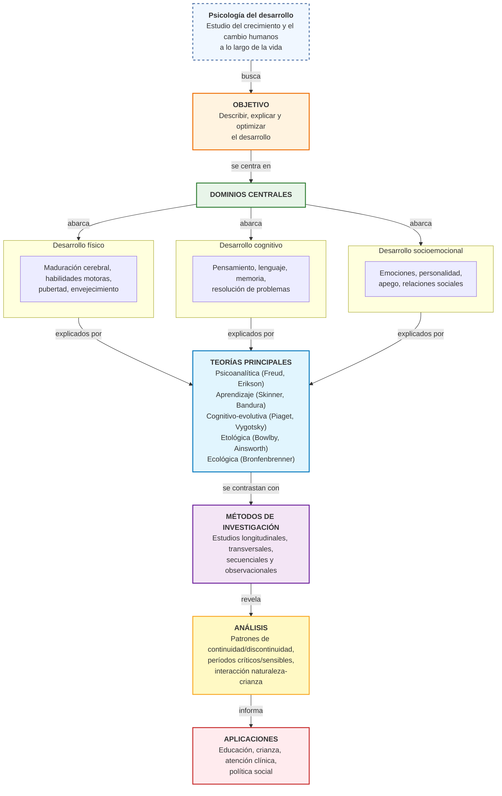

```mermaid
flowchart TD
    A[<b>Psicología del desarrollo</b><br>Estudio del crecimiento y el cambio humanos<br>a lo largo de la vida]:::title
    B[<b>OBJETIVO</b><br>Describir, explicar y optimizar<br>el desarrollo]:::goal
    C[<b>DOMINIOS CENTRALES</b>]:::domains
    subgraph D[Desarrollo físico]
        D1[Maduración cerebral, habilidades motoras,<br>pubertad, envejecimiento]
    end
    subgraph E[Desarrollo cognitivo]
        E1[Pensamiento, lenguaje, memoria,<br>resolución de problemas]
    end
    subgraph F[Desarrollo socioemocional]
        F1[Emociones, personalidad,<br>apego, relaciones sociales]
    end
    G["<b>TEORÍAS PRINCIPALES</b><br>Psicoanalítica (Freud, Erikson)<br>Aprendizaje (Skinner, Bandura)<br>Cognitivo-evolutiva (Piaget, Vygotsky)<br>Etológica (Bowlby, Ainsworth)<br>Ecológica (Bronfenbrenner)"]:::theory
    H[<b>MÉTODOS DE INVESTIGACIÓN</b><br>Estudios longitudinales, transversales,<br>secuenciales y observacionales]:::methods
    I[<b>ANÁLISIS</b><br>Patrones de continuidad/discontinuidad,<br>períodos críticos/sensibles,<br>interacción naturaleza-crianza]:::analysis
    J[<b>APLICACIONES</b><br>Educación, crianza, atención clínica,<br>política social]:::outcome

    A -->|busca| B
    B -->|se centra en| C
    C -->|abarca| D
    C -->|abarca| E
    C -->|abarca| F
    D & E & F -->|explicados por| G
    G -->|se contrastan con| H
    H -->|revela| I
    I -->|informa| J

    classDef title fill:#f0f7ff,stroke:#4a6fa5,stroke-width:2px,color:#333,stroke-dasharray: 5 5
    classDef goal fill:#fff3e0,stroke:#ef6c00,stroke-width:2px,color:#333
    classDef domains fill:#e8f5e9,stroke:#2e7d32,stroke-width:2px,color:#333
    classDef theory fill:#e1f5fe,stroke:#0277bd,stroke-width:2px,color:#333
    classDef methods fill:#f3e5f5,stroke:#6a1b9a,stroke-width:2px,color:#333
    classDef analysis fill:#fff9c4,stroke:#f9a825,stroke-width:2px,color:#333
    classDef outcome fill:#ffebee,stroke:#c62828,stroke-width:2px,color:#333
```
