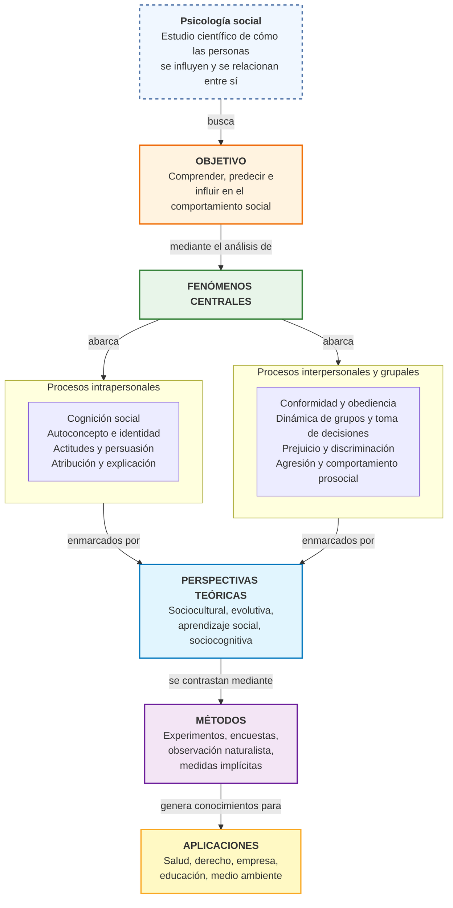

```mermaid
flowchart TD
    A[<b>Psicología social</b><br>Estudio científico de cómo las personas<br>se influyen y se relacionan entre sí]:::title
    B[<b>OBJETIVO</b><br>Comprender, predecir e<br>influir en el comportamiento social]:::goal
    C[<b>FENÓMENOS CENTRALES</b>]:::phenomena
    subgraph D[Procesos intrapersonales]
        D1[Cognición social<br>Autoconcepto e identidad<br>Actitudes y persuasión<br>Atribución y explicación]
    end
    subgraph E[Procesos interpersonales y grupales]
        E1[Conformidad y obediencia<br>Dinámica de grupos y toma de decisiones<br>Prejuicio y discriminación<br>Agresión y comportamiento prosocial]
    end
    F[<b>PERSPECTIVAS TEÓRICAS</b><br>Sociocultural, evolutiva,<br>aprendizaje social, sociocognitiva]:::theory
    G[<b>MÉTODOS</b><br>Experimentos, encuestas,<br>observación naturalista,<br>medidas implícitas]:::methods
    H[<b>APLICACIONES</b><br>Salud, derecho, empresa,<br>educación, medio ambiente]:::outcome

    A -->|busca| B
    B -->|mediante el análisis de| C
    C -->|abarca| D
    C -->|abarca| E
    D & E -->|enmarcados por| F
    F -->|se contrastan mediante| G
    G -->|genera conocimientos para| H

    classDef title fill:#f0f7ff,stroke:#4a6fa5,stroke-width:2px,color:#333,stroke-dasharray: 5 5
    classDef goal fill:#fff3e0,stroke:#ef6c00,stroke-width:2px,color:#333
    classDef phenomena fill:#e8f5e9,stroke:#2e7d32,stroke-width:2px,color:#333
    classDef theory fill:#e1f5fe,stroke:#0277bd,stroke-width:2px,color:#333
    classDef methods fill:#f3e5f5,stroke:#6a1b9a,stroke-width:2px,color:#333
    classDef outcome fill:#fff9c4,stroke:#f9a825,stroke-width:2px,color:#333
```
