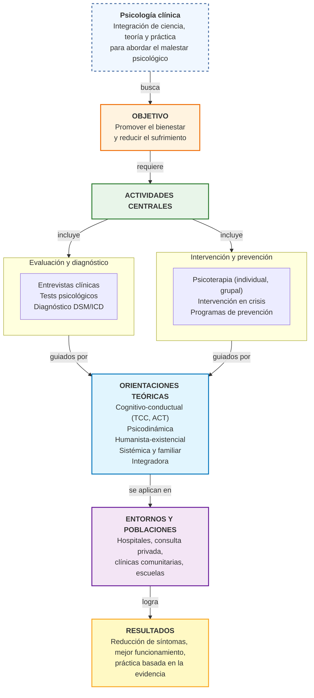

```mermaid
flowchart TD
    A[<b>Psicología clínica</b><br>Integración de ciencia, teoría y práctica<br>para abordar el malestar psicológico]:::title
    B[<b>OBJETIVO</b><br>Promover el bienestar<br>y reducir el sufrimiento]:::goal
    C[<b>ACTIVIDADES CENTRALES</b>]:::activities
    subgraph D[Evaluación y diagnóstico]
        D1[Entrevistas clínicas<br>Tests psicológicos<br>Diagnóstico DSM/ICD]
    end
    subgraph E[Intervención y prevención]
        E1["Psicoterapia (individual, grupal)<br>Intervención en crisis<br>Programas de prevención"]
    end
    F["<b>ORIENTACIONES TEÓRICAS</b><br>Cognitivo-conductual (TCC, ACT)<br>Psicodinámica<br>Humanista-existencial<br>Sistémica y familiar<br>Integradora"]:::theory
    G[<b>ENTORNOS Y POBLACIONES</b><br>Hospitales, consulta privada,<br>clínicas comunitarias, escuelas]:::settings
    H[<b>RESULTADOS</b><br>Reducción de síntomas, mejor funcionamiento,<br>práctica basada en la evidencia]:::outcome

    A -->|busca| B
    B -->|requiere| C
    C -->|incluye| D
    C -->|incluye| E
    D & E -->|guiados por| F
    F -->|se aplican en| G
    G -->|logra| H

    classDef title fill:#f0f7ff,stroke:#4a6fa5,stroke-width:2px,color:#333,stroke-dasharray: 5 5
    classDef goal fill:#fff3e0,stroke:#ef6c00,stroke-width:2px,color:#333
    classDef activities fill:#e8f5e9,stroke:#2e7d32,stroke-width:2px,color:#333
    classDef theory fill:#e1f5fe,stroke:#0277bd,stroke-width:2px,color:#333
    classDef settings fill:#f3e5f5,stroke:#6a1b9a,stroke-width:2px,color:#333
    classDef outcome fill:#fff9c4,stroke:#f9a825,stroke-width:2px,color:#333
```
