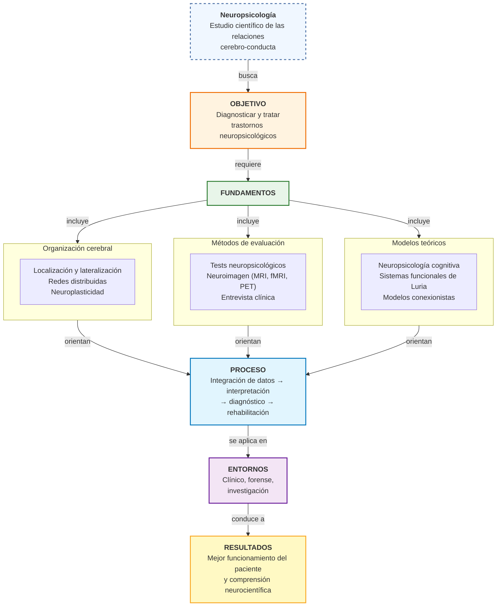

```mermaid
flowchart TD
    A[<b>Neuropsicología</b><br>Estudio científico de las relaciones<br>cerebro-conducta]:::title
    B[<b>OBJETIVO</b><br>Diagnosticar y tratar<br>trastornos neuropsicológicos]:::goal
    C[<b>FUNDAMENTOS</b>]:::foundations
    subgraph D[Organización cerebral]
        D1[Localización y lateralización<br>Redes distribuidas<br>Neuroplasticidad]
    end
    subgraph E[Métodos de evaluación]
        E1["Tests neuropsicológicos<br>Neuroimagen (MRI, fMRI, PET)<br>Entrevista clínica"]
    end
    subgraph F[Modelos teóricos]
        F1[Neuropsicología cognitiva<br>Sistemas funcionales de Luria<br>Modelos conexionistas]
    end
    G[<b>PROCESO</b><br>Integración de datos → interpretación<br>→ diagnóstico → rehabilitación]:::process
    H[<b>ENTORNOS</b><br>Clínico, forense,<br>investigación]:::settings
    I[<b>RESULTADOS</b><br>Mejor funcionamiento del paciente<br>y comprensión neurocientífica]:::outcome

    A -->|busca| B
    B -->|requiere| C
    C -->|incluye| D
    C -->|incluye| E
    C -->|incluye| F
    D & E & F -->|orientan| G
    G -->|se aplica en| H
    H -->|conduce a| I

    classDef title fill:#f0f7ff,stroke:#4a6fa5,stroke-width:2px,color:#333,stroke-dasharray: 5 5
    classDef goal fill:#fff3e0,stroke:#ef6c00,stroke-width:2px,color:#333
    classDef foundations fill:#e8f5e9,stroke:#2e7d32,stroke-width:2px,color:#333
    classDef process fill:#e1f5fe,stroke:#0277bd,stroke-width:2px,color:#333
    classDef settings fill:#f3e5f5,stroke:#6a1b9a,stroke-width:2px,color:#333
    classDef outcome fill:#fff9c4,stroke:#f9a825,stroke-width:2px,color:#333
```
