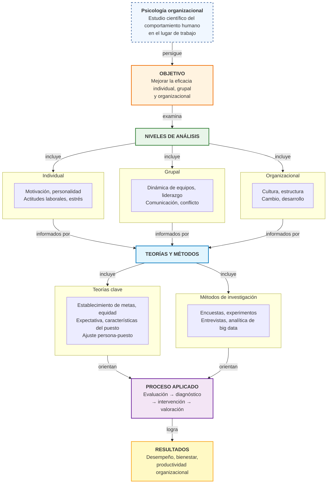

```mermaid
flowchart TD
    A[<b>Psicología organizacional</b><br>Estudio científico del comportamiento humano<br>en el lugar de trabajo]:::title
    B[<b>OBJETIVO</b><br>Mejorar la eficacia individual, grupal<br>y organizacional]:::goal
    C[<b>NIVELES DE ANÁLISIS</b>]:::levels
    subgraph D[Individual]
        D1[Motivación, personalidad<br>Actitudes laborales, estrés]
    end
    subgraph E[Grupal]
        E1[Dinámica de equipos, liderazgo<br>Comunicación, conflicto]
    end
    subgraph F[Organizacional]
        F1[Cultura, estructura<br>Cambio, desarrollo]
    end
    G[<b>TEORÍAS Y MÉTODOS</b>]:::theory
    subgraph H[Teorías clave]
        H1[Establecimiento de metas, equidad<br>Expectativa, características del puesto<br>Ajuste persona-puesto]
    end
    subgraph I[Métodos de investigación]
        I1[Encuestas, experimentos<br>Entrevistas, analítica de big data]
    end
    J[<b>PROCESO APLICADO</b><br>Evaluación → diagnóstico<br>→ intervención → valoración]:::process
    K[<b>RESULTADOS</b><br>Desempeño, bienestar,<br>productividad organizacional]:::outcome

    A -->|persigue| B
    B -->|examina| C
    C -->|incluye| D
    C -->|incluye| E
    C -->|incluye| F
    D & E & F -->|informados por| G
    G -->|incluye| H
    G -->|incluye| I
    H & I -->|orientan| J
    J -->|logra| K

    classDef title fill:#f0f7ff,stroke:#4a6fa5,stroke-width:2px,color:#333,stroke-dasharray: 5 5
    classDef goal fill:#fff3e0,stroke:#ef6c00,stroke-width:2px,color:#333
    classDef levels fill:#e8f5e9,stroke:#2e7d32,stroke-width:2px,color:#333
    classDef theory fill:#e1f5fe,stroke:#0277bd,stroke-width:2px,color:#333
    classDef process fill:#f3e5f5,stroke:#6a1b9a,stroke-width:2px,color:#333
    classDef outcome fill:#fff9c4,stroke:#f9a825,stroke-width:2px,color:#333
```
