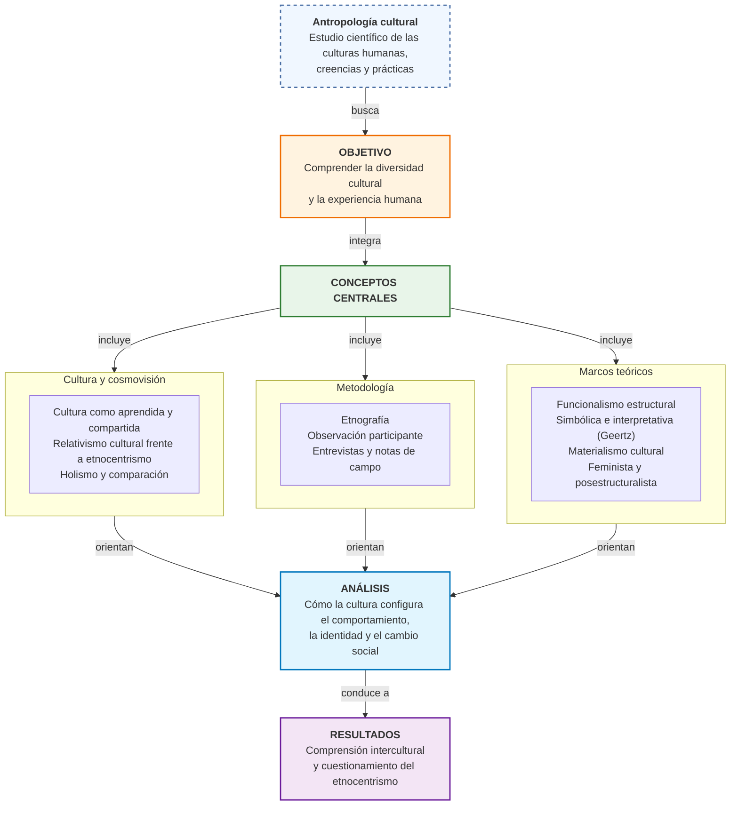

```mermaid
flowchart TD
    A[<b>Antropología cultural</b><br>Estudio científico de las culturas humanas,<br>creencias y prácticas]:::title
    B[<b>OBJETIVO</b><br>Comprender la diversidad cultural<br>y la experiencia humana]:::goal
    C[<b>CONCEPTOS CENTRALES</b>]:::concepts
    subgraph D[Cultura y cosmovisión]
        D1[Cultura como aprendida y compartida<br>Relativismo cultural frente a etnocentrismo<br>Holismo y comparación]
    end
    subgraph E[Metodología]
        E1[Etnografía<br>Observación participante<br>Entrevistas y notas de campo]
    end
    subgraph F[Marcos teóricos]
        F1["Funcionalismo estructural<br>Simbólica e interpretativa (Geertz)<br>Materialismo cultural<br>Feminista y posestructuralista"]
    end
    G[<b>ANÁLISIS</b><br>Cómo la cultura configura el comportamiento,<br>la identidad y el cambio social]:::analysis
    H[<b>RESULTADOS</b><br>Comprensión intercultural<br>y cuestionamiento del etnocentrismo]:::outcome

    A -->|busca| B
    B -->|integra| C
    C -->|incluye| D
    C -->|incluye| E
    C -->|incluye| F
    D & E & F -->|orientan| G
    G -->|conduce a| H

    classDef title fill:#f0f7ff,stroke:#4a6fa5,stroke-width:2px,color:#333,stroke-dasharray: 5 5
    classDef goal fill:#fff3e0,stroke:#ef6c00,stroke-width:2px,color:#333
    classDef concepts fill:#e8f5e9,stroke:#2e7d32,stroke-width:2px,color:#333
    classDef analysis fill:#e1f5fe,stroke:#0277bd,stroke-width:2px,color:#333
    classDef outcome fill:#f3e5f5,stroke:#6a1b9a,stroke-width:2px,color:#333
```
