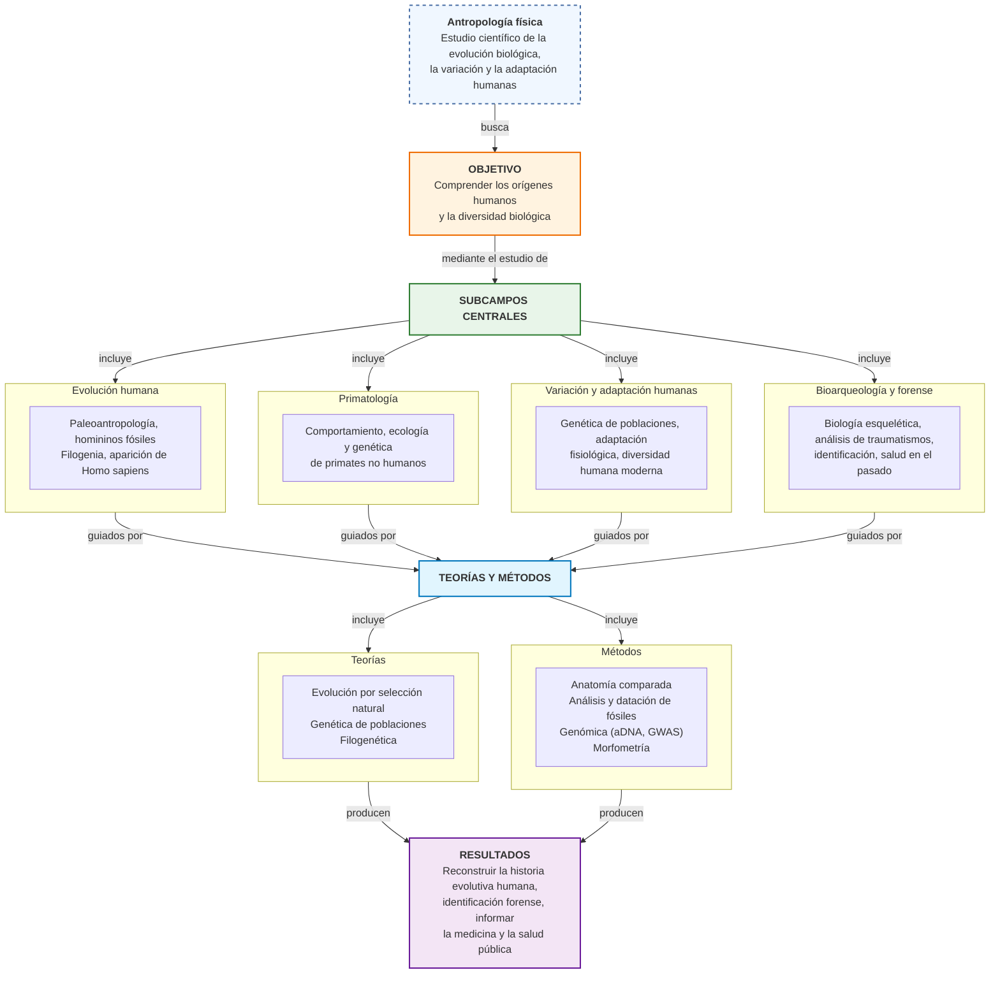

```mermaid
flowchart TD
    A[<b>Antropología física</b><br>Estudio científico de la evolución biológica,<br>la variación y la adaptación humanas]:::title
    B[<b>OBJETIVO</b><br>Comprender los orígenes humanos<br>y la diversidad biológica]:::goal
    C[<b>SUBCAMPOS CENTRALES</b>]:::subfields
    subgraph D[Evolución humana]
        D1[Paleoantropología, homininos fósiles<br>Filogenia, aparición de Homo sapiens]
    end
    subgraph E[Primatología]
        E1[Comportamiento, ecología y genética<br>de primates no humanos]
    end
    subgraph F[Variación y adaptación humanas]
        F1[Genética de poblaciones, adaptación<br>fisiológica, diversidad humana moderna]
    end
    subgraph G[Bioarqueología y forense]
        G1[Biología esquelética, análisis de traumatismos,<br>identificación, salud en el pasado]
    end
    H[<b>TEORÍAS Y MÉTODOS</b>]:::theory
    subgraph I[Teorías]
        I1[Evolución por selección natural<br>Genética de poblaciones<br>Filogenética]
    end
    subgraph J[Métodos]
        J1["Anatomía comparada<br>Análisis y datación de fósiles<br>Genómica (aDNA, GWAS)<br>Morfometría"]
    end
    K[<b>RESULTADOS</b><br>Reconstruir la historia evolutiva humana,<br>identificación forense, informar<br>la medicina y la salud pública]:::outcome

    A -->|busca| B
    B -->|mediante el estudio de| C
    C -->|incluye| D
    C -->|incluye| E
    C -->|incluye| F
    C -->|incluye| G
    D & E & F & G -->|guiados por| H
    H -->|incluye| I
    H -->|incluye| J
    I & J -->|producen| K

    classDef title fill:#f0f7ff,stroke:#4a6fa5,stroke-width:2px,color:#333,stroke-dasharray: 5 5
    classDef goal fill:#fff3e0,stroke:#ef6c00,stroke-width:2px,color:#333
    classDef subfields fill:#e8f5e9,stroke:#2e7d32,stroke-width:2px,color:#333
    classDef theory fill:#e1f5fe,stroke:#0277bd,stroke-width:2px,color:#333
    classDef outcome fill:#f3e5f5,stroke:#6a1b9a,stroke-width:2px,color:#333
```
