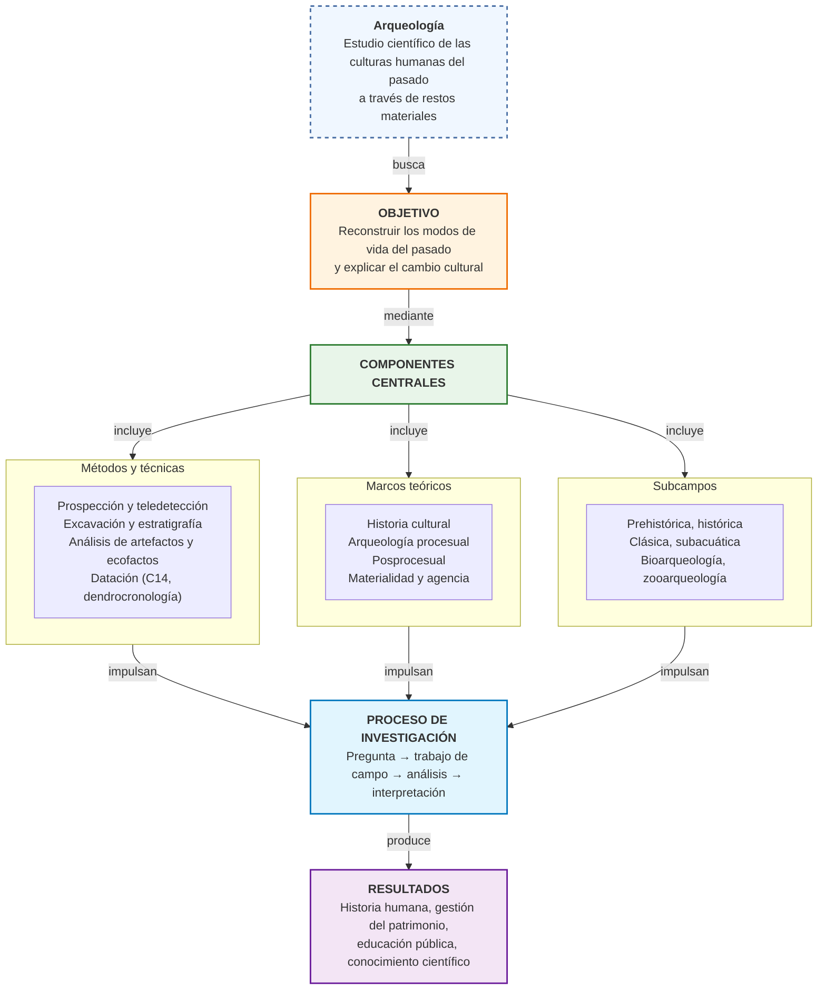

```mermaid
flowchart TD
    A[<b>Arqueología</b><br>Estudio científico de las culturas humanas del pasado<br>a través de restos materiales]:::title
    B[<b>OBJETIVO</b><br>Reconstruir los modos de vida del pasado<br>y explicar el cambio cultural]:::goal
    C[<b>COMPONENTES CENTRALES</b>]:::components
    subgraph D[Métodos y técnicas]
        D1["Prospección y teledetección<br>Excavación y estratigrafía<br>Análisis de artefactos y ecofactos<br>Datación (C14, dendrocronología)"]
    end
    subgraph E[Marcos teóricos]
        E1[Historia cultural<br>Arqueología procesual<br>Posprocesual<br>Materialidad y agencia]
    end
    subgraph F[Subcampos]
        F1[Prehistórica, histórica<br>Clásica, subacuática<br>Bioarqueología, zooarqueología]
    end
    G[<b>PROCESO DE INVESTIGACIÓN</b><br>Pregunta → trabajo de campo → análisis → interpretación]:::process
    H[<b>RESULTADOS</b><br>Historia humana, gestión del patrimonio,<br>educación pública, conocimiento científico]:::outcome

    A -->|busca| B
    B -->|mediante| C
    C -->|incluye| D
    C -->|incluye| E
    C -->|incluye| F
    D & E & F -->|impulsan| G
    G -->|produce| H

    classDef title fill:#f0f7ff,stroke:#4a6fa5,stroke-width:2px,color:#333,stroke-dasharray: 5 5
    classDef goal fill:#fff3e0,stroke:#ef6c00,stroke-width:2px,color:#333
    classDef components fill:#e8f5e9,stroke:#2e7d32,stroke-width:2px,color:#333
    classDef process fill:#e1f5fe,stroke:#0277bd,stroke-width:2px,color:#333
    classDef outcome fill:#f3e5f5,stroke:#6a1b9a,stroke-width:2px,color:#333
```
