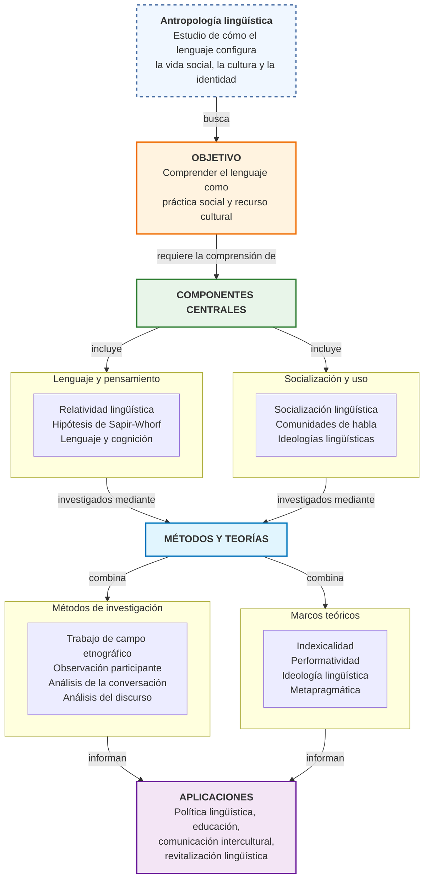

```mermaid
flowchart TD
    A[<b>Antropología lingüística</b><br>Estudio de cómo el lenguaje configura<br>la vida social, la cultura y la identidad]:::title
    B[<b>OBJETIVO</b><br>Comprender el lenguaje como<br>práctica social y recurso cultural]:::goal
    C[<b>COMPONENTES CENTRALES</b>]:::components
    subgraph D[Lenguaje y pensamiento]
        D1[Relatividad lingüística<br>Hipótesis de Sapir-Whorf<br>Lenguaje y cognición]
    end
    subgraph E[Socialización y uso]
        E1[Socialización lingüística<br>Comunidades de habla<br>Ideologías lingüísticas]
    end
    F[<b>MÉTODOS Y TEORÍAS</b>]:::methods
    subgraph G[Métodos de investigación]
        G1[Trabajo de campo etnográfico<br>Observación participante<br>Análisis de la conversación<br>Análisis del discurso]
    end
    subgraph H[Marcos teóricos]
        H1[Indexicalidad<br>Performatividad<br>Ideología lingüística<br>Metapragmática]
    end
    I[<b>APLICACIONES</b><br>Política lingüística, educación,<br>comunicación intercultural,<br>revitalización lingüística]:::outcome

    A -->|busca| B
    B -->|requiere la comprensión de| C
    C -->|incluye| D
    C -->|incluye| E
    D & E -->|investigados mediante| F
    F -->|combina| G
    F -->|combina| H
    G & H -->|informan| I

    classDef title fill:#f0f7ff,stroke:#4a6fa5,stroke-width:2px,color:#333,stroke-dasharray: 5 5
    classDef goal fill:#fff3e0,stroke:#ef6c00,stroke-width:2px,color:#333
    classDef components fill:#e8f5e9,stroke:#2e7d32,stroke-width:2px,color:#333
    classDef methods fill:#e1f5fe,stroke:#0277bd,stroke-width:2px,color:#333
    classDef outcome fill:#f3e5f5,stroke:#6a1b9a,stroke-width:2px,color:#333
```
