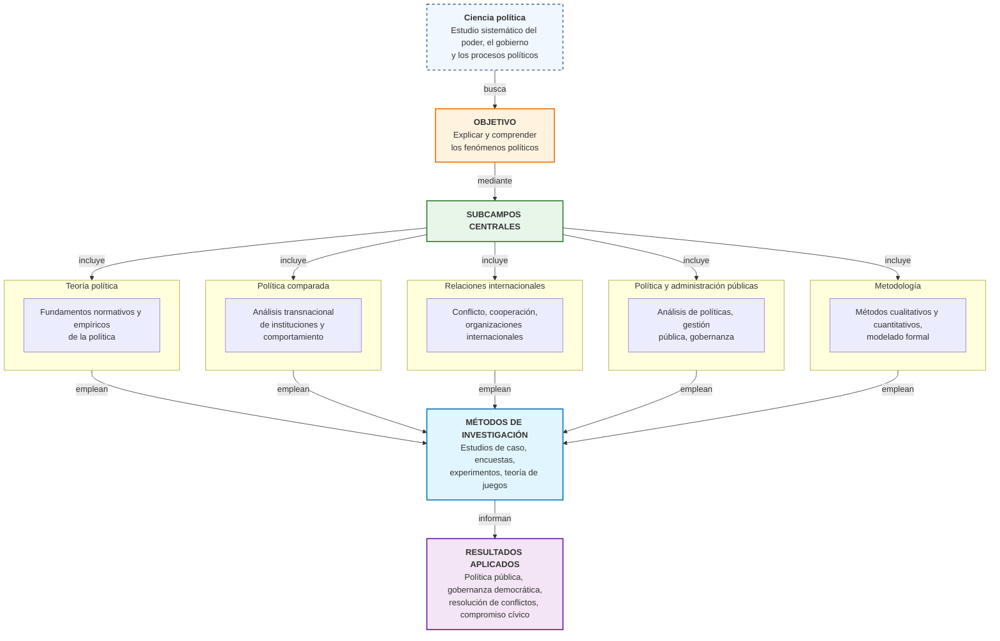

```mermaid
flowchart TD
    A[<b>Ciencia política</b><br>Estudio sistemático del poder, el gobierno<br>y los procesos políticos]:::title
    B[<b>OBJETIVO</b><br>Explicar y comprender<br>los fenómenos políticos]:::goal
    C[<b>SUBCAMPOS CENTRALES</b>]:::subfields
    subgraph D[Teoría política]
        D1[Fundamentos normativos y empíricos<br>de la política]
    end
    subgraph E[Política comparada]
        E1[Análisis transnacional<br>de instituciones y comportamiento]
    end
    subgraph F[Relaciones internacionales]
        F1[Conflicto, cooperación,<br>organizaciones internacionales]
    end
    subgraph G[Política y administración públicas]
        G1[Análisis de políticas, gestión<br>pública, gobernanza]
    end
    subgraph H[Metodología]
        H1[Métodos cualitativos y cuantitativos,<br>modelado formal]
    end
    I[<b>MÉTODOS DE INVESTIGACIÓN</b><br>Estudios de caso, encuestas,<br>experimentos, teoría de juegos]:::methods
    J[<b>RESULTADOS APLICADOS</b><br>Política pública, gobernanza democrática,<br>resolución de conflictos, compromiso cívico]:::outcome

    A -->|busca| B
    B -->|mediante| C
    C -->|incluye| D
    C -->|incluye| E
    C -->|incluye| F
    C -->|incluye| G
    C -->|incluye| H
    D & E & F & G & H -->|emplean| I
    I -->|informan| J

    classDef title fill:#f0f7ff,stroke:#4a6fa5,stroke-width:2px,color:#333,stroke-dasharray: 5 5
    classDef goal fill:#fff3e0,stroke:#ef6c00,stroke-width:2px,color:#333
    classDef subfields fill:#e8f5e9,stroke:#2e7d32,stroke-width:2px,color:#333
    classDef methods fill:#e1f5fe,stroke:#0277bd,stroke-width:2px,color:#333
    classDef outcome fill:#f3e5f5,stroke:#6a1b9a,stroke-width:2px,color:#333
```
