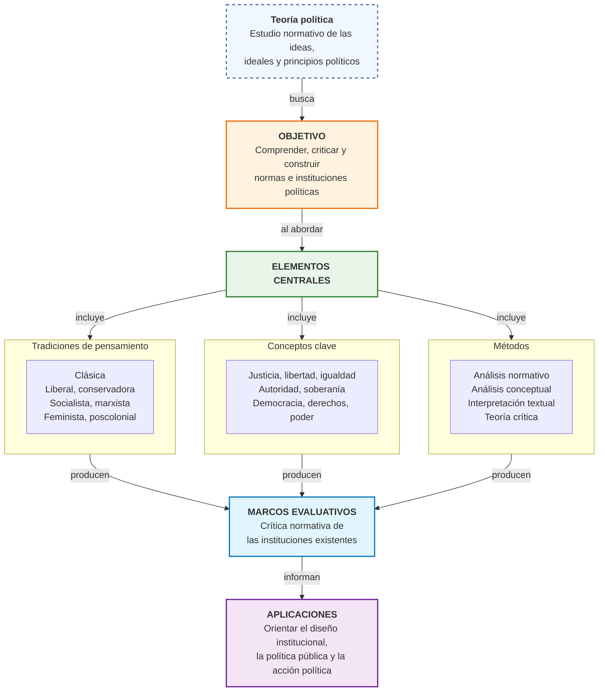

```mermaid
flowchart TD
    A[<b>Teoría política</b><br>Estudio normativo de las ideas,<br>ideales y principios políticos]:::title
    B[<b>OBJETIVO</b><br>Comprender, criticar y construir<br>normas e instituciones políticas]:::goal
    C[<b>ELEMENTOS CENTRALES</b>]:::elements
    subgraph D[Tradiciones de pensamiento]
        D1[Clásica<br>Liberal, conservadora<br>Socialista, marxista<br>Feminista, poscolonial]
    end
    subgraph E[Conceptos clave]
        E1[Justicia, libertad, igualdad<br>Autoridad, soberanía<br>Democracia, derechos, poder]
    end
    subgraph F[Métodos]
        F1[Análisis normativo<br>Análisis conceptual<br>Interpretación textual<br>Teoría crítica]
    end
    G[<b>MARCOS EVALUATIVOS</b><br>Crítica normativa de<br>las instituciones existentes]:::evaluation
    H[<b>APLICACIONES</b><br>Orientar el diseño institucional,<br>la política pública y la acción política]:::outcome

    A -->|busca| B
    B -->|al abordar| C
    C -->|incluye| D
    C -->|incluye| E
    C -->|incluye| F
    D & E & F -->|producen| G
    G -->|informan| H

    classDef title fill:#f0f7ff,stroke:#4a6fa5,stroke-width:2px,color:#333,stroke-dasharray: 5 5
    classDef goal fill:#fff3e0,stroke:#ef6c00,stroke-width:2px,color:#333
    classDef elements fill:#e8f5e9,stroke:#2e7d32,stroke-width:2px,color:#333
    classDef evaluation fill:#e1f5fe,stroke:#0277bd,stroke-width:2px,color:#333
    classDef outcome fill:#f3e5f5,stroke:#6a1b9a,stroke-width:2px,color:#333
```
