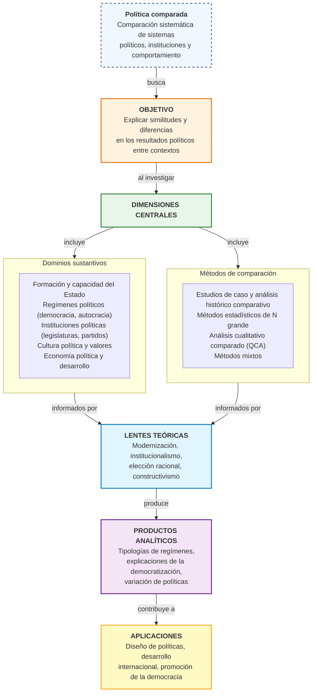

```mermaid
flowchart TD
    A[<b>Política comparada</b><br>Comparación sistemática de sistemas<br>políticos, instituciones y comportamiento]:::title
    B[<b>OBJETIVO</b><br>Explicar similitudes y diferencias<br>en los resultados políticos entre contextos]:::goal
    C[<b>DIMENSIONES CENTRALES</b>]:::dimensions
    subgraph D[Dominios sustantivos]
        D1["Formación y capacidad del Estado<br>Regímenes políticos (democracia, autocracia)<br>Instituciones políticas (legislaturas, partidos)<br>Cultura política y valores<br>Economía política y desarrollo"]
    end
    subgraph E[Métodos de comparación]
        E1["Estudios de caso y análisis histórico comparativo<br>Métodos estadísticos de N grande<br>Análisis cualitativo comparado (QCA)<br>Métodos mixtos"]
    end
    F[<b>LENTES TEÓRICAS</b><br>Modernización, institucionalismo,<br>elección racional, constructivismo]:::theory
    G[<b>PRODUCTOS ANALÍTICOS</b><br>Tipologías de regímenes,<br>explicaciones de la democratización,<br>variación de políticas]:::analysis
    H[<b>APLICACIONES</b><br>Diseño de políticas, desarrollo<br>internacional, promoción de la democracia]:::outcome

    A -->|busca| B
    B -->|al investigar| C
    C -->|incluye| D
    C -->|incluye| E
    D & E -->|informados por| F
    F -->|produce| G
    G -->|contribuye a| H

    classDef title fill:#f0f7ff,stroke:#4a6fa5,stroke-width:2px,color:#333,stroke-dasharray: 5 5
    classDef goal fill:#fff3e0,stroke:#ef6c00,stroke-width:2px,color:#333
    classDef dimensions fill:#e8f5e9,stroke:#2e7d32,stroke-width:2px,color:#333
    classDef theory fill:#e1f5fe,stroke:#0277bd,stroke-width:2px,color:#333
    classDef analysis fill:#f3e5f5,stroke:#6a1b9a,stroke-width:2px,color:#333
    classDef outcome fill:#fff9c4,stroke:#f9a825,stroke-width:2px,color:#333
```
