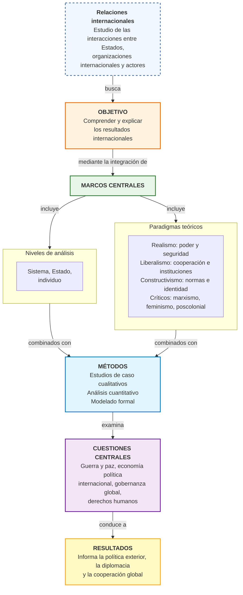

```mermaid
flowchart TD
    A[<b>Relaciones internacionales</b><br>Estudio de las interacciones entre Estados,<br>organizaciones internacionales y actores]:::title
    B[<b>OBJETIVO</b><br>Comprender y explicar<br>los resultados internacionales]:::goal
    C[<b>MARCOS CENTRALES</b>]:::frameworks
    subgraph D[Niveles de análisis]
        D1[Sistema, Estado,<br>individuo]
    end
    subgraph E[Paradigmas teóricos]
        E1[Realismo: poder y seguridad<br>Liberalismo: cooperación e instituciones<br>Constructivismo: normas e identidad<br>Críticos: marxismo, feminismo, poscolonial]
    end
    F[<b>MÉTODOS</b><br>Estudios de caso cualitativos<br>Análisis cuantitativo<br>Modelado formal]:::methods
    G[<b>CUESTIONES CENTRALES</b><br>Guerra y paz, economía política<br>internacional, gobernanza global,<br>derechos humanos]:::issues
    H[<b>RESULTADOS</b><br>Informa la política exterior, la diplomacia<br>y la cooperación global]:::outcome

    A -->|busca| B
    B -->|mediante la integración de| C
    C -->|incluye| D
    C -->|incluye| E
    D & E -->|combinados con| F
    F -->|examina| G
    G -->|conduce a| H

    classDef title fill:#f0f7ff,stroke:#4a6fa5,stroke-width:2px,color:#333,stroke-dasharray: 5 5
    classDef goal fill:#fff3e0,stroke:#ef6c00,stroke-width:2px,color:#333
    classDef frameworks fill:#e8f5e9,stroke:#2e7d32,stroke-width:2px,color:#333
    classDef methods fill:#e1f5fe,stroke:#0277bd,stroke-width:2px,color:#333
    classDef issues fill:#f3e5f5,stroke:#6a1b9a,stroke-width:2px,color:#333
    classDef outcome fill:#fff9c4,stroke:#f9a825,stroke-width:2px,color:#333
```
