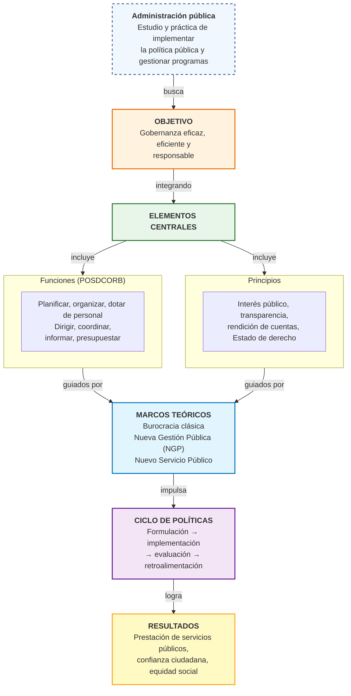

```mermaid
flowchart TD
    A[<b>Administración pública</b><br>Estudio y práctica de implementar<br>la política pública y gestionar programas]:::title
    B[<b>OBJETIVO</b><br>Gobernanza eficaz, eficiente y<br>responsable]:::goal
    C[<b>ELEMENTOS CENTRALES</b>]:::elements
    subgraph D["Funciones (POSDCORB)"]
        D1[Planificar, organizar, dotar de personal<br>Dirigir, coordinar,<br>informar, presupuestar]
    end
    subgraph E[Principios]
        E1[Interés público, transparencia,<br>rendición de cuentas, Estado de derecho]
    end
    F["<b>MARCOS TEÓRICOS</b><br>Burocracia clásica<br>Nueva Gestión Pública (NGP)<br>Nuevo Servicio Público"]:::theory
    G[<b>CICLO DE POLÍTICAS</b><br>Formulación → implementación<br>→ evaluación → retroalimentación]:::cycle
    H[<b>RESULTADOS</b><br>Prestación de servicios públicos,<br>confianza ciudadana, equidad social]:::outcome

    A -->|busca| B
    B -->|integrando| C
    C -->|incluye| D
    C -->|incluye| E
    D & E -->|guiados por| F
    F -->|impulsa| G
    G -->|logra| H

    classDef title fill:#f0f7ff,stroke:#4a6fa5,stroke-width:2px,color:#333,stroke-dasharray: 5 5
    classDef goal fill:#fff3e0,stroke:#ef6c00,stroke-width:2px,color:#333
    classDef elements fill:#e8f5e9,stroke:#2e7d32,stroke-width:2px,color:#333
    classDef theory fill:#e1f5fe,stroke:#0277bd,stroke-width:2px,color:#333
    classDef cycle fill:#f3e5f5,stroke:#6a1b9a,stroke-width:2px,color:#333
    classDef outcome fill:#fff9c4,stroke:#f9a825,stroke-width:2px,color:#333
```
