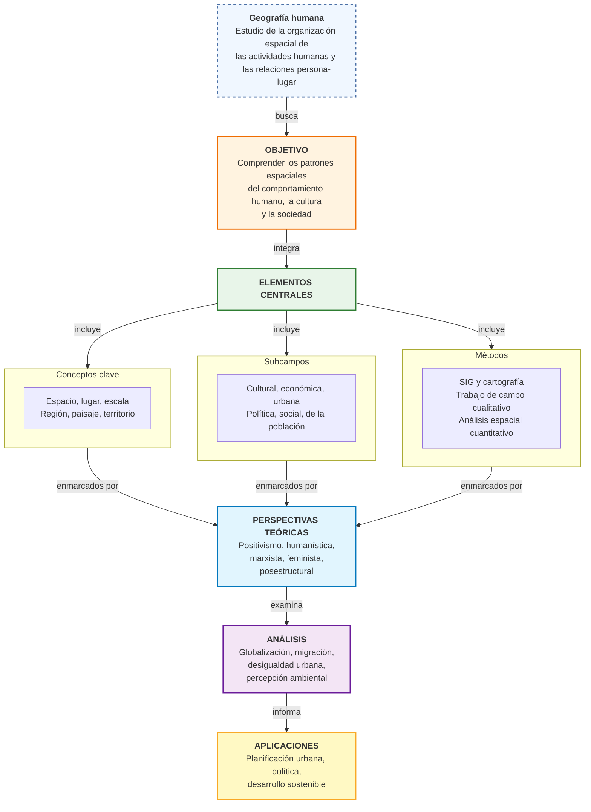

```mermaid
flowchart TD
    A[<b>Geografía humana</b><br>Estudio de la organización espacial de<br>las actividades humanas y las relaciones persona-lugar]:::title
    B[<b>OBJETIVO</b><br>Comprender los patrones espaciales<br>del comportamiento humano, la cultura<br>y la sociedad]:::goal
    C[<b>ELEMENTOS CENTRALES</b>]:::elements
    subgraph D[Conceptos clave]
        D1[Espacio, lugar, escala<br>Región, paisaje, territorio]
    end
    subgraph E[Subcampos]
        E1[Cultural, económica, urbana<br>Política, social, de la población]
    end
    subgraph F[Métodos]
        F1[SIG y cartografía<br>Trabajo de campo cualitativo<br>Análisis espacial cuantitativo]
    end
    G[<b>PERSPECTIVAS TEÓRICAS</b><br>Positivismo, humanística,<br>marxista, feminista,<br>posestructural]:::theory
    H[<b>ANÁLISIS</b><br>Globalización, migración,<br>desigualdad urbana,<br>percepción ambiental]:::analysis
    I[<b>APLICACIONES</b><br>Planificación urbana, política,<br>desarrollo sostenible]:::outcome

    A -->|busca| B
    B -->|integra| C
    C -->|incluye| D
    C -->|incluye| E
    C -->|incluye| F
    D & E & F -->|enmarcados por| G
    G -->|examina| H
    H -->|informa| I

    classDef title fill:#f0f7ff,stroke:#4a6fa5,stroke-width:2px,color:#333,stroke-dasharray: 5 5
    classDef goal fill:#fff3e0,stroke:#ef6c00,stroke-width:2px,color:#333
    classDef elements fill:#e8f5e9,stroke:#2e7d32,stroke-width:2px,color:#333
    classDef theory fill:#e1f5fe,stroke:#0277bd,stroke-width:2px,color:#333
    classDef analysis fill:#f3e5f5,stroke:#6a1b9a,stroke-width:2px,color:#333
    classDef outcome fill:#fff9c4,stroke:#f9a825,stroke-width:2px,color:#333
```
