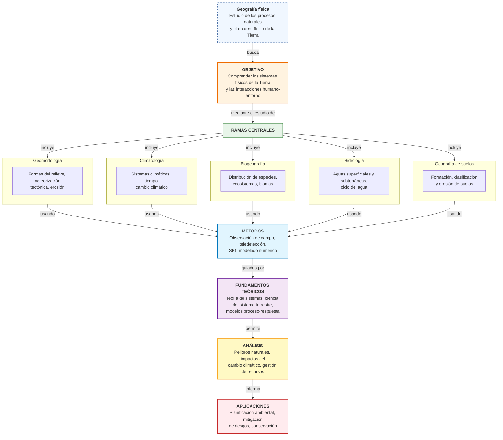

```mermaid
flowchart TD
    A[<b>Geografía física</b><br>Estudio de los procesos naturales<br>y el entorno físico de la Tierra]:::title
    B[<b>OBJETIVO</b><br>Comprender los sistemas físicos de la Tierra<br>y las interacciones humano-entorno]:::goal
    C[<b>RAMAS CENTRALES</b>]:::branches
    subgraph D[Geomorfología]
        D1[Formas del relieve, meteorización,<br>tectónica, erosión]
    end
    subgraph E[Climatología]
        E1[Sistemas climáticos, tiempo,<br>cambio climático]
    end
    subgraph F[Biogeografía]
        F1[Distribución de especies,<br>ecosistemas, biomas]
    end
    subgraph G[Hidrología]
        G1[Aguas superficiales y subterráneas,<br>ciclo del agua]
    end
    subgraph H[Geografía de suelos]
        H1[Formación, clasificación<br>y erosión de suelos]
    end
    I[<b>MÉTODOS</b><br>Observación de campo, teledetección,<br>SIG, modelado numérico]:::methods
    J[<b>FUNDAMENTOS TEÓRICOS</b><br>Teoría de sistemas, ciencia del sistema terrestre,<br>modelos proceso-respuesta]:::theory
    K[<b>ANÁLISIS</b><br>Peligros naturales, impactos del<br>cambio climático, gestión de recursos]:::analysis
    L[<b>APLICACIONES</b><br>Planificación ambiental, mitigación<br>de riesgos, conservación]:::outcome

    A -->|busca| B
    B -->|mediante el estudio de| C
    C -->|incluye| D
    C -->|incluye| E
    C -->|incluye| F
    C -->|incluye| G
    C -->|incluye| H
    D & E & F & G & H -->|usando| I
    I -->|guiados por| J
    J -->|permite| K
    K -->|informa| L

    classDef title fill:#f0f7ff,stroke:#4a6fa5,stroke-width:2px,color:#333,stroke-dasharray: 5 5
    classDef goal fill:#fff3e0,stroke:#ef6c00,stroke-width:2px,color:#333
    classDef branches fill:#e8f5e9,stroke:#2e7d32,stroke-width:2px,color:#333
    classDef methods fill:#e1f5fe,stroke:#0277bd,stroke-width:2px,color:#333
    classDef theory fill:#f3e5f5,stroke:#6a1b9a,stroke-width:2px,color:#333
    classDef analysis fill:#fff9c4,stroke:#f9a825,stroke-width:2px,color:#333
    classDef outcome fill:#ffebee,stroke:#c62828,stroke-width:2px,color:#333
```
