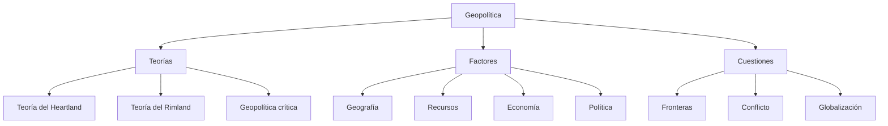

```mermaid
flowchart TD
    G[Geopolítica] --> T[Teorías]
    G --> F[Factores]
    G --> I[Cuestiones]

    T --> H[Teoría del Heartland]
    T --> R[Teoría del Rimland]
    T --> C[Geopolítica crítica]

    F --> G2[Geografía]
    F --> R2[Recursos]
    F --> E[Economía]
    F --> P[Política]

    I --> B[Fronteras]
    I --> C2[Conflicto]
    I --> G3[Globalización]
```
