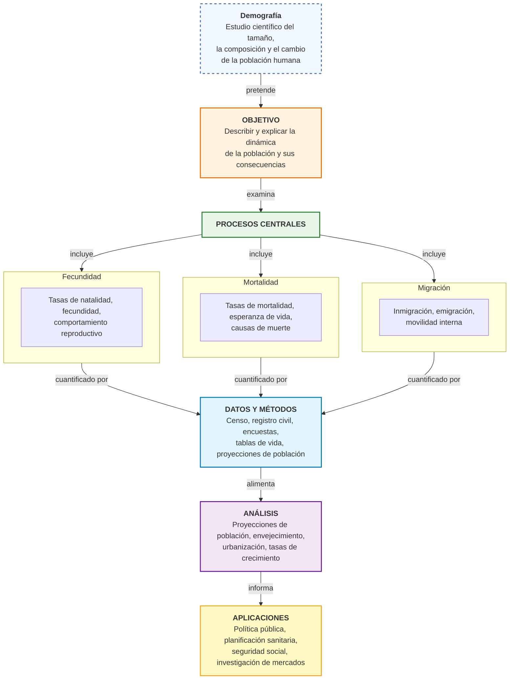

```mermaid
flowchart TD
    A[<b>Demografía</b><br>Estudio científico del tamaño,<br>la composición y el cambio<br>de la población humana]:::title
    B[<b>OBJETIVO</b><br>Describir y explicar la dinámica<br>de la población y sus consecuencias]:::goal
    C[<b>PROCESOS CENTRALES</b>]:::processes
    subgraph D[Fecundidad]
        D1[Tasas de natalidad, fecundidad,<br>comportamiento reproductivo]
    end
    subgraph E[Mortalidad]
        E1[Tasas de mortalidad, esperanza de vida,<br>causas de muerte]
    end
    subgraph F[Migración]
        F1[Inmigración, emigración,<br>movilidad interna]
    end
    G[<b>DATOS Y MÉTODOS</b><br>Censo, registro civil, encuestas,<br>tablas de vida, proyecciones de población]:::methods
    H[<b>ANÁLISIS</b><br>Proyecciones de población, envejecimiento,<br>urbanización, tasas de crecimiento]:::analysis
    I[<b>APLICACIONES</b><br>Política pública, planificación sanitaria,<br>seguridad social, investigación de mercados]:::outcome

    A -->|pretende| B
    B -->|examina| C
    C -->|incluye| D
    C -->|incluye| E
    C -->|incluye| F
    D & E & F -->|cuantificado por| G
    G -->|alimenta| H
    H -->|informa| I

    classDef title fill:#f0f7ff,stroke:#4a6fa5,stroke-width:2px,color:#333,stroke-dasharray: 5 5
    classDef goal fill:#fff3e0,stroke:#ef6c00,stroke-width:2px,color:#333
    classDef processes fill:#e8f5e9,stroke:#2e7d32,stroke-width:2px,color:#333
    classDef methods fill:#e1f5fe,stroke:#0277bd,stroke-width:2px,color:#333
    classDef analysis fill:#f3e5f5,stroke:#6a1b9a,stroke-width:2px,color:#333
    classDef outcome fill:#fff9c4,stroke:#f9a825,stroke-width:2px,color:#333
```
