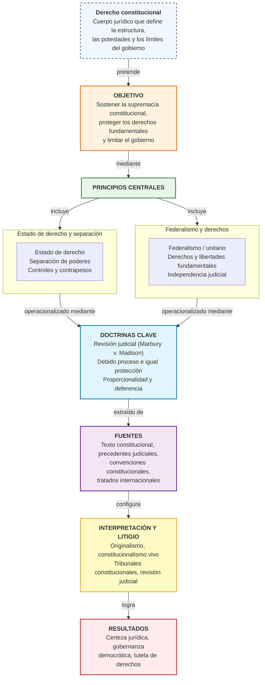

```mermaid
flowchart TD
    A[<b>Derecho constitucional</b><br>Cuerpo jurídico que define la estructura,<br>las potestades y los límites del gobierno]:::title
    B[<b>OBJETIVO</b><br>Sostener la supremacía constitucional,<br>proteger los derechos fundamentales<br>y limitar el gobierno]:::goal
    C[<b>PRINCIPIOS CENTRALES</b>]:::principles
    subgraph D[Estado de derecho y separación]
        D1[Estado de derecho<br>Separación de poderes<br>Controles y contrapesos]
    end
    subgraph E[Federalismo y derechos]
        E1[Federalismo / unitario<br>Derechos y libertades fundamentales<br>Independencia judicial]
    end
    F["<b>DOCTRINAS CLAVE</b><br>Revisión judicial (Marbury v. Madison)<br>Debido proceso e igual protección<br>Proporcionalidad y deferencia"]:::doctrines
    G[<b>FUENTES</b><br>Texto constitucional, precedentes judiciales,<br>convenciones constitucionales,<br>tratados internacionales]:::sources
    H[<b>INTERPRETACIÓN Y LITIGIO</b><br>Originalismo, constitucionalismo vivo<br>Tribunales constitucionales, revisión judicial]:::process
    I[<b>RESULTADOS</b><br>Certeza jurídica, gobernanza<br>democrática, tutela de derechos]:::outcome

    A -->|pretende| B
    B -->|mediante| C
    C -->|incluye| D
    C -->|incluye| E
    D & E -->|operacionalizado mediante| F
    F -->|extraído de| G
    G -->|configura| H
    H -->|logra| I

    classDef title fill:#f0f7ff,stroke:#4a6fa5,stroke-width:2px,color:#333,stroke-dasharray: 5 5
    classDef goal fill:#fff3e0,stroke:#ef6c00,stroke-width:2px,color:#333
    classDef principles fill:#e8f5e9,stroke:#2e7d32,stroke-width:2px,color:#333
    classDef doctrines fill:#e1f5fe,stroke:#0277bd,stroke-width:2px,color:#333
    classDef sources fill:#f3e5f5,stroke:#6a1b9a,stroke-width:2px,color:#333
    classDef process fill:#fff9c4,stroke:#f9a825,stroke-width:2px,color:#333
    classDef outcome fill:#ffebee,stroke:#c62828,stroke-width:2px,color:#333
```
