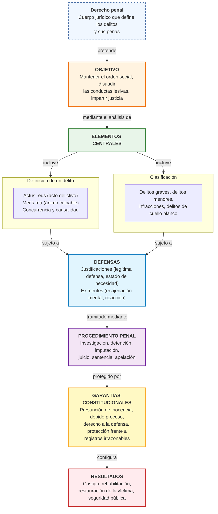

```mermaid
flowchart TD
    A[<b>Derecho penal</b><br>Cuerpo jurídico que define los delitos<br>y sus penas]:::title
    B[<b>OBJETIVO</b><br>Mantener el orden social, disuadir<br>las conductas lesivas, impartir justicia]:::goal
    C[<b>ELEMENTOS CENTRALES</b>]:::elements
    subgraph D[Definición de un delito]
        D1["Actus reus (acto delictivo)<br>Mens rea (ánimo culpable)<br>Concurrencia y causalidad"]
    end
    subgraph E[Clasificación]
        E1[Delitos graves, delitos menores,<br>infracciones, delitos de cuello blanco]
    end
    F["<b>DEFENSAS</b><br>Justificaciones (legítima defensa, estado de necesidad)<br>Eximentes (enajenación mental, coacción)"]:::defenses
    G[<b>PROCEDIMIENTO PENAL</b><br>Investigación, detención, imputación,<br>juicio, sentencia, apelación]:::procedure
    H[<b>GARANTÍAS CONSTITUCIONALES</b><br>Presunción de inocencia, debido proceso,<br>derecho a la defensa, protección frente a<br>registros irrazonables]:::rights
    I[<b>RESULTADOS</b><br>Castigo, rehabilitación,<br>restauración de la víctima, seguridad pública]:::outcome

    A -->|pretende| B
    B -->|mediante el análisis de| C
    C -->|incluye| D
    C -->|incluye| E
    D & E -->|sujeto a| F
    F -->|tramitado mediante| G
    G -->|protegido por| H
    H -->|configura| I

    classDef title fill:#f0f7ff,stroke:#4a6fa5,stroke-width:2px,color:#333,stroke-dasharray: 5 5
    classDef goal fill:#fff3e0,stroke:#ef6c00,stroke-width:2px,color:#333
    classDef elements fill:#e8f5e9,stroke:#2e7d32,stroke-width:2px,color:#333
    classDef defenses fill:#e1f5fe,stroke:#0277bd,stroke-width:2px,color:#333
    classDef procedure fill:#f3e5f5,stroke:#6a1b9a,stroke-width:2px,color:#333
    classDef rights fill:#fff9c4,stroke:#f9a825,stroke-width:2px,color:#333
    classDef outcome fill:#ffebee,stroke:#c62828,stroke-width:2px,color:#333
```
