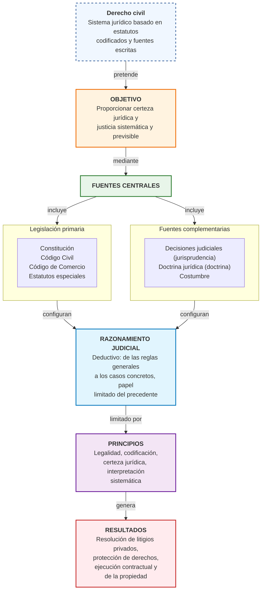

```mermaid
flowchart TD
    A[<b>Derecho civil</b><br>Sistema jurídico basado en estatutos<br>codificados y fuentes escritas]:::title
    B[<b>OBJETIVO</b><br>Proporcionar certeza jurídica y<br>justicia sistemática y previsible]:::goal
    C[<b>FUENTES CENTRALES</b>]:::sources
    subgraph D[Legislación primaria]
        D1[Constitución<br>Código Civil<br>Código de Comercio<br>Estatutos especiales]
    end
    subgraph E[Fuentes complementarias]
        E1["Decisiones judiciales (jurisprudencia)<br>Doctrina jurídica (doctrina)<br>Costumbre"]
    end
    F[<b>RAZONAMIENTO JUDICIAL</b><br>Deductivo: de las reglas generales<br>a los casos concretos, papel<br>limitado del precedente]:::reasoning
    G[<b>PRINCIPIOS</b><br>Legalidad, codificación,<br>certeza jurídica, interpretación<br>sistemática]:::principles
    H[<b>RESULTADOS</b><br>Resolución de litigios privados,<br>protección de derechos,<br>ejecución contractual y<br>de la propiedad]:::outcome

    A -->|pretende| B
    B -->|mediante| C
    C -->|incluye| D
    C -->|incluye| E
    D & E -->|configuran| F
    F -->|limitado por| G
    G -->|genera| H

    classDef title fill:#f0f7ff,stroke:#4a6fa5,stroke-width:2px,color:#333,stroke-dasharray: 5 5
    classDef goal fill:#fff3e0,stroke:#ef6c00,stroke-width:2px,color:#333
    classDef sources fill:#e8f5e9,stroke:#2e7d32,stroke-width:2px,color:#333
    classDef reasoning fill:#e1f5fe,stroke:#0277bd,stroke-width:2px,color:#333
    classDef principles fill:#f3e5f5,stroke:#6a1b9a,stroke-width:2px,color:#333
    classDef outcome fill:#ffebee,stroke:#c62828,stroke-width:2px,color:#333
```
