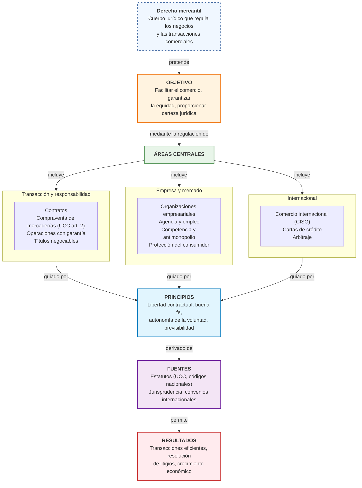

```mermaid
flowchart TD
    A[<b>Derecho mercantil</b><br>Cuerpo jurídico que regula los negocios<br>y las transacciones comerciales]:::title
    B[<b>OBJETIVO</b><br>Facilitar el comercio, garantizar<br>la equidad, proporcionar certeza jurídica]:::goal
    C[<b>ÁREAS CENTRALES</b>]:::areas
    subgraph D[Transacción y responsabilidad]
        D1["Contratos<br>Compraventa de mercaderías (UCC art. 2)<br>Operaciones con garantía<br>Títulos negociables"]
    end
    subgraph E[Empresa y mercado]
        E1[Organizaciones empresariales<br>Agencia y empleo<br>Competencia y antimonopolio<br>Protección del consumidor]
    end
    subgraph F[Internacional]
        F1["Comercio internacional (CISG)<br>Cartas de crédito<br>Arbitraje"]
    end
    G[<b>PRINCIPIOS</b><br>Libertad contractual, buena fe,<br>autonomía de la voluntad, previsibilidad]:::principles
    H["<b>FUENTES</b><br>Estatutos (UCC, códigos nacionales)<br>Jurisprudencia, convenios internacionales"]:::sources
    I[<b>RESULTADOS</b><br>Transacciones eficientes, resolución<br>de litigios, crecimiento económico]:::outcome

    A -->|pretende| B
    B -->|mediante la regulación de| C
    C -->|incluye| D
    C -->|incluye| E
    C -->|incluye| F
    D & E & F -->|guiado por| G
    G -->|derivado de| H
    H -->|permite| I

    classDef title fill:#f0f7ff,stroke:#4a6fa5,stroke-width:2px,color:#333,stroke-dasharray: 5 5
    classDef goal fill:#fff3e0,stroke:#ef6c00,stroke-width:2px,color:#333
    classDef areas fill:#e8f5e9,stroke:#2e7d32,stroke-width:2px,color:#333
    classDef principles fill:#e1f5fe,stroke:#0277bd,stroke-width:2px,color:#333
    classDef sources fill:#f3e5f5,stroke:#6a1b9a,stroke-width:2px,color:#333
    classDef outcome fill:#ffebee,stroke:#c62828,stroke-width:2px,color:#333
```
